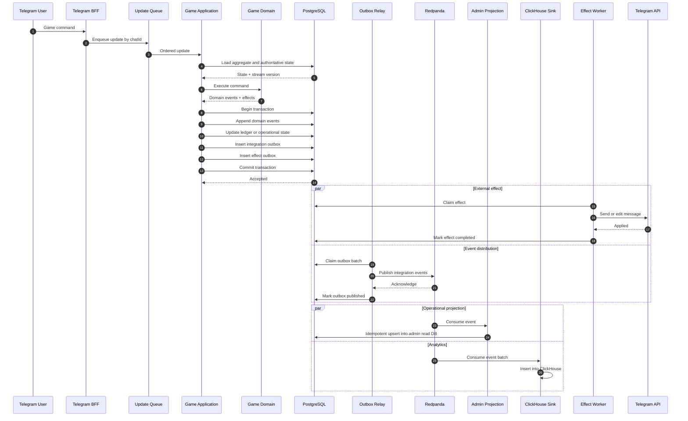
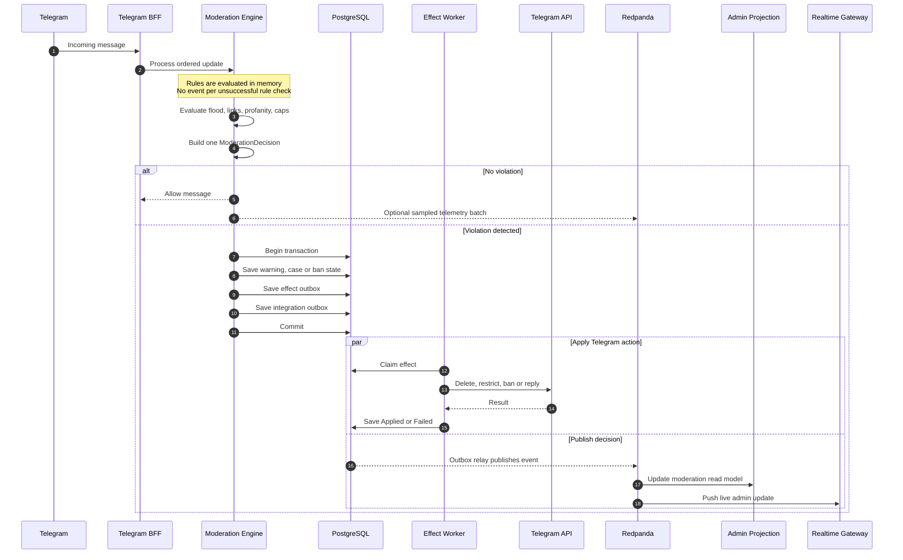

 **PostgreSQL stay authoritative write-side и ledger**, but **Redpanda/Kafka become shared  event backbone for projections, ClickHouse, realtime-admin panel и cross module events**.

```mermaid
flowchart TB

%% =========================================================
%% EXTERNAL CLIENTS
%% =========================================================

subgraph Clients["Clients and external systems"]
    TG["Telegram"]
    DC["Discord"]
    ADMIN_UI["Admin Web UI"]
    EXT_API["External REST API"]
end

%% =========================================================
%% EDGE / TRANSPORT
%% =========================================================

subgraph Edge["Transport и Edge Layer"]
    TG_BFF["Telegram BFF<br/>Webhook / Long Polling<br/>Telegram ACL"]
    DC_BFF["Discord BFF<br/>Discord ACL"]
    ADMIN_BFF["Admin BFF<br/>Commands + Queries + Auth"]
    PUBLIC_API["Public REST BFF"]
    REALTIME["Admin Realtime Gateway<br/>SignalR / SSE"]
end

TG --> TG_BFF
DC --> DC_BFF
ADMIN_UI --> ADMIN_BFF
ADMIN_UI <-->|"Live updates"| REALTIME
EXT_API --> PUBLIC_API

%% =========================================================
%% INGRESS
%% =========================================================

subgraph Ingress["Ingress Pipeline"]
    UPDATE_QUEUE["Partitioned Update Queue<br/>Redis Streams или Redpanda<br/>key = tenantId + chatId"]
    UPDATE_ROUTER["Update Router<br/>Deduplication<br/>Ordering per chat"]
    COMMAND_ROUTER["Command Router"]
end

TG_BFF --> UPDATE_QUEUE
DC_BFF --> UPDATE_QUEUE
UPDATE_QUEUE --> UPDATE_ROUTER
UPDATE_ROUTER --> COMMAND_ROUTER

%% =========================================================
%% APPLICATION / DOMAIN MODULES
%% =========================================================

subgraph Backend["Backend Modules"]

    subgraph Games["Game Bounded Contexts"]
        GAME_APP["Game Application Layer"]
        GAME_DOMAIN["Game Domain<br/>Blackjack / Poker / Dice / Horse<br/>Challenges / Turn-based framework"]
        GAME_EFFECTS["Game Effects<br/>Render / Send / Schedule"]
    end

    subgraph Economy["Economy and Ledger"]
        ECONOMY_APP["Economy Application"]
        LEDGER["Double-entry Ledger Domain"]
        WALLET["Wallet / Balance Domain"]
    end

    subgraph ChatAdmin["Chat Administration"]
        CHAT_APP["Chat Administration Application"]
        MOD_ENGINE["Moderation Engine<br/>Rules evaluated in memory"]
        CHAT_DOMAIN["Roles / Warnings / Bans<br/>Cases / Chat settings"]
        MOD_EFFECTS["Moderation Effects<br/>Delete / Restrict / Ban / Reply"]
    end

    subgraph Users["Users and Identity"]
        USER_APP["User Application"]
        USER_DOMAIN["Users / Profiles / Tenants / Bots"]
    end

    subgraph Meta["Cross-game Modules"]
        TOURNAMENTS["Tournaments"]
        ACHIEVEMENTS["Achievements"]
        LEADERBOARD["Leaderboards"]
        REWARDS["Daily Rewards"]
    end
end

COMMAND_ROUTER --> GAME_APP
COMMAND_ROUTER --> CHAT_APP
COMMAND_ROUTER --> USER_APP

PUBLIC_API --> GAME_APP
PUBLIC_API --> ECONOMY_APP
PUBLIC_API --> USER_APP

ADMIN_BFF -->|"Game commands"| GAME_APP
ADMIN_BFF -->|"Ledger commands"| ECONOMY_APP
ADMIN_BFF -->|"Moderation commands"| CHAT_APP
ADMIN_BFF -->|"User commands"| USER_APP

GAME_APP --> GAME_DOMAIN
GAME_DOMAIN --> GAME_EFFECTS
GAME_DOMAIN --> ECONOMY_APP

ECONOMY_APP --> LEDGER
ECONOMY_APP --> WALLET

CHAT_APP --> MOD_ENGINE
MOD_ENGINE --> CHAT_DOMAIN
CHAT_DOMAIN --> MOD_EFFECTS

USER_APP --> USER_DOMAIN

%% =========================================================
%% AUTHORITATIVE STORAGE
%% =========================================================

subgraph WriteStorage["Authoritative PostgreSQL Write Side"]

    EVENT_STORE[("Domain Event Store<br/>streamId + version<br/>append-only")]

    LEDGER_DB[("Ledger<br/>entries + balances<br/>strong consistency")]

    OPERATIONAL_DB[("Operational State<br/>users / games / moderation<br/>settings / roles / cases")]

    EFFECT_OUTBOX[("Effect Outbox<br/>Telegram / Discord / Render")]

    INTEGRATION_OUTBOX[("Integration Outbox<br/>events for Redpanda")]

    WORKFLOW_DB[("Wolverine / Saga State<br/>durable workflows")]
end

GAME_DOMAIN -->|"Atomic transaction"| EVENT_STORE
GAME_DOMAIN -->|"Atomic transaction"| OPERATIONAL_DB
GAME_EFFECTS -->|"Atomic transaction"| EFFECT_OUTBOX

LEDGER -->|"Atomic transaction"| LEDGER_DB
WALLET -->|"Atomic transaction"| LEDGER_DB

CHAT_DOMAIN -->|"Atomic transaction"| OPERATIONAL_DB
CHAT_DOMAIN -->|"Audit events"| EVENT_STORE
MOD_EFFECTS -->|"Atomic transaction"| EFFECT_OUTBOX

USER_DOMAIN -->|"Atomic transaction"| OPERATIONAL_DB
USER_DOMAIN -->|"Domain events"| EVENT_STORE

GAME_DOMAIN --> INTEGRATION_OUTBOX
LEDGER --> INTEGRATION_OUTBOX
CHAT_DOMAIN --> INTEGRATION_OUTBOX
USER_DOMAIN --> INTEGRATION_OUTBOX

GAME_APP --> WORKFLOW_DB
CHAT_APP --> WORKFLOW_DB

%% =========================================================
%% EFFECT EXECUTION
%% =========================================================

subgraph EffectWorkers["Effect Execution"]

    EFFECT_DISPATCHER["Effect Dispatcher<br/>leases + retries + idempotency"]

    TG_EFFECT_WORKER["Telegram Effect Worker"]
    DC_EFFECT_WORKER["Discord Effect Worker"]
    RENDER_WORKER["Rendering Workers<br/>SkiaSharp / GIF / Images"]
    JOB_WORKER["Background Job Workers"]
end

EFFECT_OUTBOX --> EFFECT_DISPATCHER

EFFECT_DISPATCHER --> TG_EFFECT_WORKER
EFFECT_DISPATCHER --> DC_EFFECT_WORKER
EFFECT_DISPATCHER --> RENDER_WORKER
EFFECT_DISPATCHER --> JOB_WORKER

TG_EFFECT_WORKER --> TG_BFF
DC_EFFECT_WORKER --> DC_BFF

%% =========================================================
%% OBJECT STORAGE
%% =========================================================

subgraph ObjectStorage["Object Storage"]
    MINIO[("MinIO / S3<br/>GIF / Images / Imports / Exports")]
end

RENDER_WORKER --> MINIO
TG_EFFECT_WORKER --> MINIO
DC_EFFECT_WORKER --> MINIO

%% =========================================================
%% REDPANDA / KAFKA
%% =========================================================

subgraph Kafka["Redpanda / Kafka Event Backbone"]

    OUTBOX_RELAY["Transactional Outbox Relay<br/>batching + SKIP LOCKED<br/>idempotent producer"]

    GAME_TOPIC["casino.game-events.v1<br/>key = tenantId + gameId"]

    LEDGER_TOPIC["casino.ledger-events.v1<br/>key = tenantId + accountId"]

    MOD_TOPIC["casino.moderation-events.v1<br/>key = tenantId + chatId"]

    USER_TOPIC["casino.user-events.v1<br/>key = tenantId + userId"]

    AUDIT_TOPIC["casino.admin-audit-events.v1<br/>key = tenantId + adminId"]

    TELEMETRY_TOPIC["casino.telemetry.v1<br/>high-volume sampled events"]

    DLQ_TOPIC["Dead Letter Topics"]
end

INTEGRATION_OUTBOX --> OUTBOX_RELAY

OUTBOX_RELAY --> GAME_TOPIC
OUTBOX_RELAY --> LEDGER_TOPIC
OUTBOX_RELAY --> MOD_TOPIC
OUTBOX_RELAY --> USER_TOPIC
OUTBOX_RELAY --> AUDIT_TOPIC

MOD_ENGINE -.->|"Batched non-authoritative telemetry"| TELEMETRY_TOPIC
GAME_APP -.->|"Performance telemetry"| TELEMETRY_TOPIC

%% =========================================================
%% CONSUMERS
%% =========================================================

subgraph Consumers["Independent Consumer Groups"]

    ADMIN_PROJECTION["Admin Projection Workers"]
    CLICKHOUSE_SINK["ClickHouse Sink<br/>batched ingestion"]
    ACHIEVEMENT_CONSUMER["Achievements Consumer"]
    LEADERBOARD_CONSUMER["Leaderboard Consumer"]
    TOURNAMENT_CONSUMER["Tournament Consumer"]
    NOTIFICATION_CONSUMER["Notification Consumer"]
    FRAUD_CONSUMER["Fraud / Abuse Consumer"]
    REALTIME_CONSUMER["Realtime Admin Consumer"]
    CACHE_CONSUMER["Cache Invalidation Consumer"]
end

GAME_TOPIC --> ADMIN_PROJECTION
LEDGER_TOPIC --> ADMIN_PROJECTION
MOD_TOPIC --> ADMIN_PROJECTION
USER_TOPIC --> ADMIN_PROJECTION
AUDIT_TOPIC --> ADMIN_PROJECTION

GAME_TOPIC --> CLICKHOUSE_SINK
LEDGER_TOPIC --> CLICKHOUSE_SINK
MOD_TOPIC --> CLICKHOUSE_SINK
USER_TOPIC --> CLICKHOUSE_SINK
AUDIT_TOPIC --> CLICKHOUSE_SINK
TELEMETRY_TOPIC --> CLICKHOUSE_SINK

GAME_TOPIC --> ACHIEVEMENT_CONSUMER
GAME_TOPIC --> LEADERBOARD_CONSUMER
GAME_TOPIC --> TOURNAMENT_CONSUMER

LEDGER_TOPIC --> ACHIEVEMENT_CONSUMER
LEDGER_TOPIC --> FRAUD_CONSUMER

MOD_TOPIC --> FRAUD_CONSUMER
MOD_TOPIC --> NOTIFICATION_CONSUMER

GAME_TOPIC --> NOTIFICATION_CONSUMER
USER_TOPIC --> NOTIFICATION_CONSUMER

GAME_TOPIC --> REALTIME_CONSUMER
LEDGER_TOPIC --> REALTIME_CONSUMER
MOD_TOPIC --> REALTIME_CONSUMER
AUDIT_TOPIC --> REALTIME_CONSUMER

GAME_TOPIC --> CACHE_CONSUMER
MOD_TOPIC --> CACHE_CONSUMER
USER_TOPIC --> CACHE_CONSUMER

ACHIEVEMENT_CONSUMER --> ACHIEVEMENTS
LEADERBOARD_CONSUMER --> LEADERBOARD
TOURNAMENT_CONSUMER --> TOURNAMENTS

NOTIFICATION_CONSUMER --> EFFECT_OUTBOX

%% =========================================================
%% READ MODELS
%% =========================================================

subgraph ReadSide["Read Side"]

    ADMIN_READ_DB[("Admin PostgreSQL Read Models<br/>current operational state")]

    REDIS[("Redis<br/>cache / rate limits<br/>live ephemeral state")]

    CLICKHOUSE[("ClickHouse<br/>history / analytics / aggregates")]

    SEARCH_INDEX[("Optional Search Index<br/>OpenSearch / Meilisearch")]
end

ADMIN_PROJECTION --> ADMIN_READ_DB
CACHE_CONSUMER --> REDIS
CLICKHOUSE_SINK --> CLICKHOUSE
ADMIN_PROJECTION --> SEARCH_INDEX

%% =========================================================
%% ADMIN QUERIES
%% =========================================================

ADMIN_BFF -->|"Current games / users / moderation"| ADMIN_READ_DB
ADMIN_BFF -->|"Charts / history / RTP / DAU / rules stats"| CLICKHOUSE
ADMIN_BFF -->|"Hot live state"| REDIS
ADMIN_BFF -->|"Full-text search"| SEARCH_INDEX

REALTIME_CONSUMER --> REALTIME

%% =========================================================
%% RUNTIME READS
%% =========================================================

GAME_APP --> REDIS
CHAT_APP --> REDIS
USER_APP --> REDIS

GAME_APP -->|"Authoritative command reads"| OPERATIONAL_DB
CHAT_APP -->|"Authoritative command reads"| OPERATIONAL_DB
ECONOMY_APP -->|"Authoritative balances"| LEDGER_DB

%% =========================================================
%% OBSERVABILITY
%% =========================================================

subgraph Observability["Observability"]

    OTEL["OpenTelemetry Collector"]
    PROM["Prometheus / VictoriaMetrics"]
    GRAFANA["Grafana"]
    LOGS["Structured Logs"]
end

TG_BFF -.-> OTEL
DC_BFF -.-> OTEL
ADMIN_BFF -.-> OTEL
GAME_APP -.-> OTEL
CHAT_APP -.-> OTEL
ECONOMY_APP -.-> OTEL
OUTBOX_RELAY -.-> OTEL
CLICKHOUSE_SINK -.-> OTEL
EFFECT_DISPATCHER -.-> OTEL

OTEL --> PROM
OTEL --> LOGS
PROM --> GRAFANA
CLICKHOUSE --> GRAFANA
```



Critcal path for 1 game command:


Apply of moderation rule:



### Source of truth

```text
PostgreSQL
├── game streams and aggregate versions
├── ledger entries and balances
├── roles, warnings, bans and moderation cases
├── game configuration and rules
├── transactional integration outbox
└── effect outbox
```

### Redpanda responsiblity

```text
Redpanda
├── cheap fan-out
├── independent consumer groups
├── backlog и backpressure
├── replay selected projections
├── ClickHouse delivery
├── realtime admin events
├── achievements / leaderboards / tournaments
└── fraud и notification pipelines
```

**Command don't depend on Redpand**: if Kafka dies, games ledger continue commit to postgres. events accumulates at outbox and projectsion will catch up after recovery.