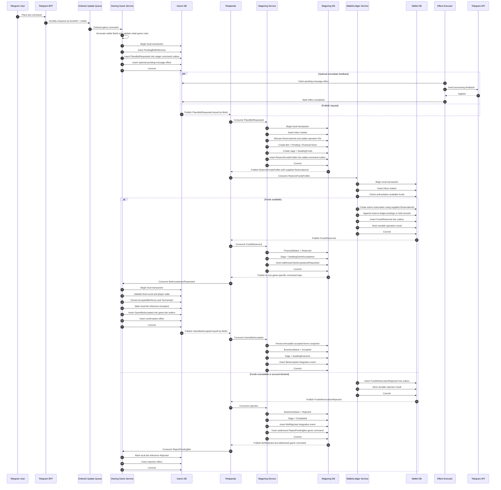
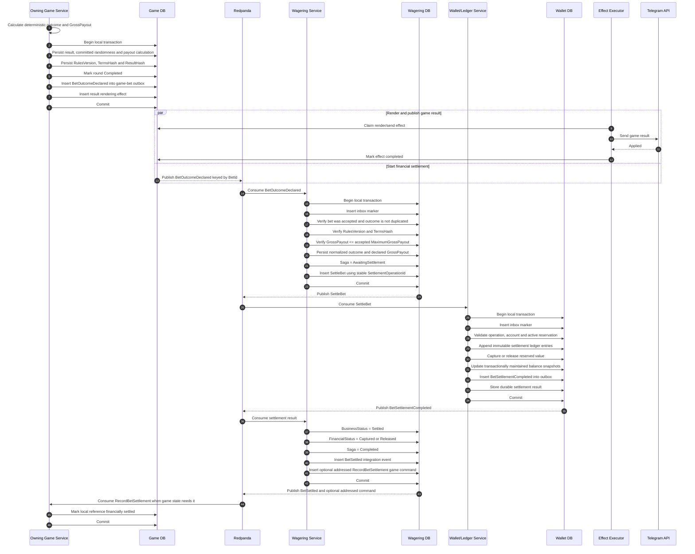
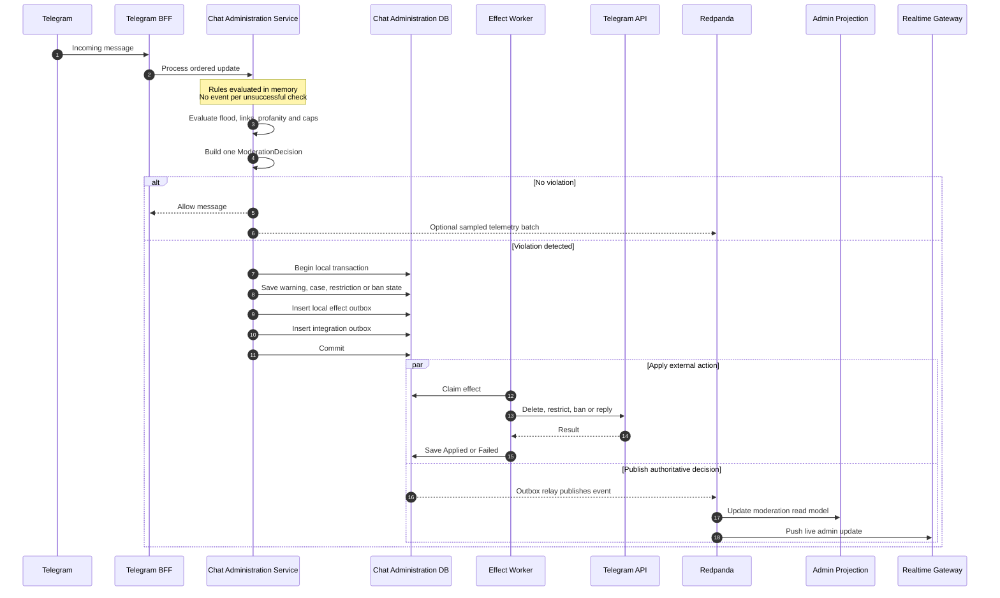

# CasinoShiz: distributed domain architecture

## 1. Core decision

**PostgreSQL remains the authoritative write-side**, but ownership is split by bounded context. Each service owns its state, migrations, inbox and outbox. **Redpanda/Kafka is the shared integration backbone**, not the source of truth and not a distributed transaction coordinator.

The architecture uses the following consistency model:

```text
inside one service:
    atomic local transaction

between services:
    local transaction
    + integration outbox
    + at-least-once delivery
    + idempotent inbox handler
    + durable saga state
    + compensating command where required
```

Once a command has been accepted by a domain service, its local commit must not depend on Redpanda being available. If the broker is unavailable, the service commits its own state and outbox records to PostgreSQL. Relays publish the backlog after recovery.

Ingress availability is a separate concern. If Telegram or Discord updates are first persisted through Redis Streams or Redpanda, the edge layer can accept an update only when that ingress queue durably accepts it. This does not change the rule that a domain-service transaction never synchronously waits for an integration-message publish.

### Framework-owned infrastructure

The framework provides the infrastructure adapters; domain services depend only on framework contracts:

```text
DotNetCore.CAP + PostgreSQL + Redis Streams or Kafka/Redpanda
    integration-event outbox, transport, consumer groups and retries

WolverineFx.Postgresql
    durable local commands, workflow steps and saga/workflow recovery

Quartz.NET
    scheduled local timeouts and recurring jobs
```

Modules and services must not instantiate CAP, Wolverine or Quartz directly. They publish framework
contracts (`IIntegrationEventPublisher`, `IIntegrationCommandPublisher`, typed handlers), and provide
service-owned domain state/migrations. The deployment selects the broker with `Messaging:Transport`
(`Redis`, `Kafka` or `Local`). Kafka and Redpanda use CAP's Kafka provider;
`Kafka:Servers` (or `Kafka:BootstrapServers`) points to the broker, and `Kafka:MainConfig` passes
through librdkafka settings such as SASL/TLS options. Changing the transport does not change domain
handlers or the framework inbox.

The current repository profile is deliberately an incremental rollout of this boundary:

- `AddFrameworkIntegrationMessaging` configures CAP with PostgreSQL persistence and the selected Redis
  Streams or Kafka transport. With `Local` it uses an in-process adapter for local tests and
  development; handlers do not change.
- `AddDurableWorkflows` configures Wolverine's PostgreSQL message store, durable local queues, retries,
  step audit and replay from the framework composition root. A module supplies only immutable command
  records and handlers.
- Identity and Wallet already register the integration-messaging boundary. Backend and existing game
  workflows use the same framework-owned composition points.
- Integration delivery is wrapped by the framework's PostgreSQL `IIntegrationInbox`. Its
  `ExecuteOnceAsync` callback receives the current connection and transaction, stores the handler
  result, and replays that result for a duplicate message. Handlers that mutate domain state use the
  supplied transaction (or `IIntegrationInboxContextAccessor`) so the inbox marker and local state
  commit or roll back together.
- Integration publishers write to the framework-owned PostgreSQL integration outbox. When an inbox
  transaction is active, the outbox insert uses that exact connection and transaction; otherwise it
  opens its own local transaction. The relay claims rows with leases and `SKIP LOCKED`, publishes the
  retained envelope through CAP, and retries after failures. A relay crash can duplicate a publish,
  so consumers still require inbox idempotency.
- `IIntegrationMessageRouter` derives a stable topic and partition key from tenant, scope and the
  first aggregate identity. A contract may implement `IIntegrationMessageRouted` to select an
  addressable bounded-context topic and explicit key. The key is persisted with the envelope and is
  forwarded to Kafka/Redpanda as `cap-kafka-key`.
- The dispatcher validates schema version, stable contract type, JSON and payload message type before
  resolving a handler. Poison messages are stored in the service-owned quarantine table with a stable
  error code and are acknowledged instead of retrying forever. Replay or ManualReview remains an
  explicit operator/domain action.
- `AddDurableWorkflows` exposes `IDurableWorkflowRecoveryService`. It persists timeout commands in
  `durable_workflow_timeouts`, claims them with leases, sends them through Wolverine, retries with
  bounded backoff, and supports idempotent cancellation and workflow inspection.
- Database ownership checks are available through `ServiceOwnership:Enforce`. They verify the
  expected database/schema and privileges and reject superuser or `BYPASSRLS` runtime roles. The
  check is disabled by default for existing deployments and should be enabled after service-specific
  PostgreSQL roles are provisioned.

The initial integration lanes are framework-owned shared command and event lanes. Handler registration
is the service-side filter; the transport can later be partitioned into the bounded-context topics shown
in the topology without changing domain contracts. Contract types used across deployables must live in a
shared contracts assembly, not in an implementation-only service assembly.

---

## 2. Bounded contexts and ownership

### Identity Service

Owns:

- users;
- tenants;
- bots;
- external identities and Telegram/Discord bindings;
- tenant membership;
- global account status;
- authentication and authorization claims that are not chat-scoped.

Does not own:

- balances;
- chat roles;
- moderation cases;
- game state;
- bets.

### Wallet/Ledger Service

Owns:

- wallets and accounts;
- ledger subaccounts such as available funds, reserved funds and treasury accounts;
- reservations and holds;
- immutable double-entry ledger entries;
- derived or materialized balance snapshots;
- financial limits;
- settlement operations;
- financial idempotency records;
- reconciliation state.

It is the only service allowed to authoritatively answer whether money is available, reserved, captured, released or paid out.

`available`, `reserved` and `posted` are not three independent mutable sources of truth. The authoritative model is the immutable ledger plus active reservations or explicit ledger subaccounts. A practical model is:

```text
posted balance   = sum of immutable ledger entries
reserved amount  = sum of active reservations
available amount = posted balance - reserved amount
```

For stricter double-entry accounting, reservation and settlement move value between explicit subaccounts:

```text
reserve: UserAvailable -> UserReserved
loss:    UserReserved  -> CasinoTreasury
cancel:  UserReserved  -> UserAvailable
win:     UserReserved  -> UserAvailable
         CasinoTreasury -> UserAvailable  // profit
```

Materialized balance columns are allowed only as transactionally maintained performance projections of the ledger, never as independent financial truth.

### Wagering Service

Owns:

- bets;
- authoritative bet lifecycle;
- bet-to-game references;
- betting limits that apply across games;
- betting saga state;
- preallocated reservation, settlement and release operation identifiers;
- immutable snapshots of accepted betting terms;
- reservation and settlement correlation;
- compensation workflow;
- disputes and manual-review state;
- normalized betting history.

It coordinates Game Services and Wallet/Ledger without owning either game state or money. It validates that a declared game outcome matches the terms previously accepted by the Game Service, but it does not implement game-specific payout formulas.

### Chat Administration Service

Owns:

- chat-scoped roles;
- rules;
- warnings;
- bans and restrictions;
- moderation cases;
- chat settings;
- moderation audit state;
- moderation rate-limit and rule configuration.

`Owner`, `Administrator` and `Moderator` of a concrete Telegram or Discord chat are chat-domain roles and therefore remain here, not in Identity.

### Game Services

Each game service owns only its game-specific state and rules. For example:

- Blackjack Service;
- Poker Service;
- Dice Service;
- Horse Racing Service;
- Challenges Service;
- Turn-based Game Runtime where shared implementation is justified.

Each service owns:

- sessions and rounds;
- players participating in the game;
- deterministic game state;
- pending and accepted bet references;
- game-specific validation;
- accepted betting terms, odds or payout conditions for its own game;
- rules version and immutable terms hash;
- random seed or committed outcome data required for deterministic replay;
- game-specific outcome and gross payout calculation;
- game result;
- game-specific local effects.

A Game Service does not own balances, ledger entries, wallet reservations or the authoritative lifecycle of a bet. It does own the game-specific computation that turns an accepted stake and game result into an outcome and gross payout.

### Cross-game consumers and services

Potential consumers and bounded contexts include:

- Achievements;
- Leaderboards;
- Tournaments;
- Rewards;
- Fraud and Abuse;
- Notifications;
- Analytics.

A stateless projector may remain only a consumer. Once one of these components owns commands, workflows, idempotency or durable business state, it becomes a service and must own its own database or schema, inbox, outbox, migrations and operational metrics.

They do not participate in the critical betting path unless explicitly required by a business invariant.

---

## 3. Database and migration ownership

Every stateful service owns:

```text
service database or isolated PostgreSQL schema
├── authoritative domain tables
├── aggregate versions or event streams where required
├── inbox_messages with durable processing result
├── integration_outbox
├── local_effect_outbox where required
├── saga state owned by this service
├── idempotency records
└── service-owned migrations
```

Rules:

1. No service reads another service's tables directly.
2. No cross-service foreign keys.
3. References to foreign aggregates are stored as opaque IDs.
4. Every service executes only its own migrations.
5. Shared PostgreSQL infrastructure is allowed, but shared ownership of tables is not.
6. A local transaction may modify only data owned by one service.
7. Read models may combine data from several services, but they are non-authoritative projections.
8. A relay, timeout worker or effect dispatcher uses credentials for exactly one owning service.
9. No shared runtime process receives unrestricted credentials for all service schemas.

A practical deployment can begin with one PostgreSQL cluster and separate schemas/users:

```text
identity.*
wallet.*
wagering.*
chat_admin.*
game_blackjack.*
game_poker.*
game_dice.*
game_horse.*
achievements.*       // only when stateful
leaderboards.*       // only when stateful
tournaments.*        // only when stateful
rewards.*            // only when stateful
notifications.*      // only when stateful
fraud.*              // only when stateful
admin_read.*
```

This preserves operational simplicity while enforcing transactional boundaries. The `DB` blocks in the topology mean service-owned logical storage; they may initially be schemas in one cluster and later become separate PostgreSQL databases or instances without changing ownership.

Schema isolation is valid only when enforced by PostgreSQL privileges. Each runtime role must have access only to its own schema, the `public` schema must not be writable, and migration privileges should be held by a separate service-specific migration role. Normal runtime roles must not use superuser or `BYPASSRLS` privileges.

---

## 4. Full system topology

```mermaid
flowchart TB

%% =========================================================
%% EXTERNAL CLIENTS
%% =========================================================

subgraph Clients["Clients and external systems"]
    TG["Telegram"]
    DC["Discord"]
    ADMIN_UI["Admin Web UI"]
    EXT_API["External REST API"]
end

%% =========================================================
%% EDGE / TRANSPORT
%% =========================================================

subgraph Edge["Transport and Edge Layer"]
    TG_BFF["Telegram BFF<br/>Webhook / Long Polling<br/>Telegram ACL"]
    DC_BFF["Discord BFF<br/>Discord ACL"]
    ADMIN_BFF["Admin BFF<br/>Commands + Queries + Auth"]
    PUBLIC_API["Public REST BFF"]
    REALTIME["Admin Realtime Gateway<br/>SignalR / SSE"]
end

TG --> TG_BFF
DC --> DC_BFF
ADMIN_UI --> ADMIN_BFF
ADMIN_UI <-->|"Live updates"| REALTIME
EXT_API --> PUBLIC_API

%% =========================================================
%% INGRESS
%% =========================================================

subgraph Ingress["Ingress Pipeline"]
    UPDATE_QUEUE["Partitioned Update Queue<br/>Redis Streams or Redpanda<br/>key = tenantId + chatId"]
    UPDATE_ROUTER["Update Router<br/>Deduplication<br/>Ordering per chat"]
    COMMAND_ROUTER["Command Router"]
end

TG_BFF --> UPDATE_QUEUE
DC_BFF --> UPDATE_QUEUE
UPDATE_QUEUE --> UPDATE_ROUTER
UPDATE_ROUTER --> COMMAND_ROUTER

%% =========================================================
%% DOMAIN SERVICES
%% =========================================================

subgraph Services["Domain Services"]

    subgraph Identity["Identity Service"]
        ID_APP["Identity Application"]
        ID_DOMAIN["Users / Tenants / Bots<br/>External identities"]
    end

    subgraph ChatAdmin["Chat Administration Service"]
        CHAT_APP["Chat Administration Application"]
        MOD_ENGINE["Moderation Engine<br/>Rules evaluated in memory"]
        CHAT_DOMAIN["Chat roles / Rules / Warnings<br/>Bans / Cases / Settings"]
        MOD_EFFECTS["Moderation Local Effects<br/>Delete / Restrict / Ban / Reply"]
    end

    subgraph Wagering["Wagering Service"]
        WAGER_APP["Wagering Application"]
        BET_DOMAIN["Bet Domain<br/>Lifecycle / limits / accepted terms / disputes"]
        BET_SAGA["Bet Saga Orchestrator<br/>Reserve / Accept / Settle / Release"]
    end

    subgraph Wallet["Wallet / Ledger Service"]
        WALLET_APP["Wallet Application"]
        WALLET_DOMAIN["Wallet / Reservations / Derived Balances"]
        LEDGER_DOMAIN["Double-entry Ledger<br/>Immutable postings / subaccounts"]
    end

    subgraph Games["Independent Game Services"]
        BLACKJACK["Blackjack Service"]
        POKER["Poker Service"]
        DICE["Dice Service"]
        HORSE["Horse Service"]
        OTHER_GAMES["Challenges / Other Games"]
    end

    subgraph Meta["Stateful Cross-game Services when required"]
        TOURNAMENTS["Tournaments"]
        ACHIEVEMENTS["Achievements"]
        LEADERBOARD["Leaderboards"]
        REWARDS["Rewards"]
    end
end

COMMAND_ROUTER --> ID_APP
COMMAND_ROUTER --> CHAT_APP
COMMAND_ROUTER --> BLACKJACK
COMMAND_ROUTER --> POKER
COMMAND_ROUTER --> DICE
COMMAND_ROUTER --> HORSE
COMMAND_ROUTER --> OTHER_GAMES

PUBLIC_API --> ID_APP
PUBLIC_API --> WAGER_APP
PUBLIC_API --> WALLET_APP

ADMIN_BFF -->|"Identity commands"| ID_APP
ADMIN_BFF -->|"Moderation commands"| CHAT_APP
ADMIN_BFF -->|"Bet commands and reviews"| WAGER_APP
ADMIN_BFF -->|"Ledger commands"| WALLET_APP
ADMIN_BFF -->|"Game commands"| BLACKJACK
ADMIN_BFF -->|"Game commands"| POKER
ADMIN_BFF -->|"Game commands"| DICE
ADMIN_BFF -->|"Game commands"| HORSE

ID_APP --> ID_DOMAIN
CHAT_APP --> MOD_ENGINE
MOD_ENGINE --> CHAT_DOMAIN
CHAT_DOMAIN --> MOD_EFFECTS
WAGER_APP --> BET_DOMAIN
WAGER_APP --> BET_SAGA
WALLET_APP --> WALLET_DOMAIN
WALLET_APP --> LEDGER_DOMAIN

%% =========================================================
%% SERVICE-OWNED WRITE STORAGE
%% =========================================================

subgraph WriteStorage["Authoritative PostgreSQL Write Side"]
    ID_DB[("Identity DB<br/>users / tenants / bots<br/>inbox + outbox")]
    CHAT_DB[("Chat Administration DB<br/>roles / rules / cases<br/>inbox + outbox + effects")]
    WAGER_DB[("Wagering DB<br/>bets / terms / saga / disputes<br/>inbox + outbox")]
    WALLET_DB[("Wallet / Ledger DB<br/>accounts / reservations / subaccounts<br/>entries / snapshots / inbox + outbox")]
    BJ_DB[("Blackjack DB<br/>sessions / rounds / terms / events<br/>inbox + outbox + effects")]
    POKER_DB[("Poker DB<br/>sessions / rounds / terms / events<br/>inbox + outbox + effects")]
    DICE_DB[("Dice DB<br/>rounds / terms / outcomes<br/>inbox + outbox + effects")]
    HORSE_DB[("Horse DB<br/>races / terms / outcomes<br/>inbox + outbox + effects")]
    OTHER_DB[("Other Game DBs<br/>state / terms / events<br/>inbox + outbox + effects")]
end

ID_DOMAIN -->|"Atomic local transaction"| ID_DB
CHAT_DOMAIN -->|"Atomic local transaction"| CHAT_DB
MOD_EFFECTS -->|"Atomic local effect enqueue"| CHAT_DB
BET_DOMAIN -->|"Atomic local transaction"| WAGER_DB
BET_SAGA -->|"Saga transition + outbox"| WAGER_DB
WALLET_DOMAIN -->|"Atomic reservation transaction"| WALLET_DB
LEDGER_DOMAIN -->|"Atomic financial posting"| WALLET_DB
BLACKJACK -->|"Atomic local transaction"| BJ_DB
POKER -->|"Atomic local transaction"| POKER_DB
DICE -->|"Atomic local transaction"| DICE_DB
HORSE -->|"Atomic local transaction"| HORSE_DB
OTHER_GAMES -->|"Atomic local transaction"| OTHER_DB

%% =========================================================
%% SERVICE-OWNED DELIVERY AND SHARED EXECUTORS
%% =========================================================

subgraph Delivery["Delivery and Effect Execution"]
    OUTBOX_RELAYS["One Outbox Relay per owning service<br/>service-local credentials<br/>batching + SKIP LOCKED"]
    EFFECT_DISPATCHERS["One Effect Dispatcher per owning service<br/>service-local credentials<br/>leases + retries"]
    TRANSPORT_EFFECT_TOPIC["Transport-effect topics<br/>prepared external commands"]
    TG_EFFECT_WORKER["Telegram Executor"]
    DC_EFFECT_WORKER["Discord Executor"]
    RENDER_WORKER["Rendering Executors<br/>SkiaSharp / GIF / Images"]
    JOB_WORKER["Background Job Executors"]
end

ID_DB --> OUTBOX_RELAYS
CHAT_DB --> OUTBOX_RELAYS
WAGER_DB --> OUTBOX_RELAYS
WALLET_DB --> OUTBOX_RELAYS
BJ_DB --> OUTBOX_RELAYS
POKER_DB --> OUTBOX_RELAYS
DICE_DB --> OUTBOX_RELAYS
HORSE_DB --> OUTBOX_RELAYS
OTHER_DB --> OUTBOX_RELAYS

CHAT_DB --> EFFECT_DISPATCHERS
BJ_DB --> EFFECT_DISPATCHERS
POKER_DB --> EFFECT_DISPATCHERS
DICE_DB --> EFFECT_DISPATCHERS
HORSE_DB --> EFFECT_DISPATCHERS
OTHER_DB --> EFFECT_DISPATCHERS

EFFECT_DISPATCHERS --> TRANSPORT_EFFECT_TOPIC
TRANSPORT_EFFECT_TOPIC --> TG_EFFECT_WORKER
TRANSPORT_EFFECT_TOPIC --> DC_EFFECT_WORKER
TRANSPORT_EFFECT_TOPIC --> RENDER_WORKER
TRANSPORT_EFFECT_TOPIC --> JOB_WORKER
TG_EFFECT_WORKER --> TG_BFF
DC_EFFECT_WORKER --> DC_BFF

%% =========================================================
%% OBJECT STORAGE
%% =========================================================

subgraph ObjectStorage["Object Storage"]
    MINIO[("MinIO / S3<br/>GIF / Images / Imports / Exports")]
end

RENDER_WORKER --> MINIO
TG_EFFECT_WORKER --> MINIO
DC_EFFECT_WORKER --> MINIO

%% =========================================================
%% REDPANDA / KAFKA
%% =========================================================

subgraph Kafka["Redpanda / Kafka Integration Backbone"]
    IDENTITY_EVENT_TOPIC["casino.identity-events.v1<br/>key = tenantId + userId"]
    WALLET_COMMAND_TOPIC["casino.wallet-commands.v1<br/>key = tenantId + accountId"]
    WALLET_EVENT_TOPIC["casino.wallet-events.v1<br/>key = tenantId + accountId"]
    WAGER_COMMAND_TOPIC["casino.wager-commands.v1<br/>key = tenantId + betId"]
    WAGER_EVENT_TOPIC["casino.wager-events.v1<br/>key = tenantId + betId"]
    GAME_EVENT_TOPIC["casino.game-events.v1<br/>key = tenantId + gameId or roundId"]
    GAME_BET_EVENT_TOPIC["casino.game-bet-events.v1<br/>key = tenantId + betId"]
    BJ_COMMAND_TOPIC["casino.game.blackjack.commands.v1<br/>key = tenantId + gameId"]
    POKER_COMMAND_TOPIC["casino.game.poker.commands.v1<br/>key = tenantId + gameId"]
    DICE_COMMAND_TOPIC["casino.game.dice.commands.v1<br/>key = tenantId + gameId"]
    HORSE_COMMAND_TOPIC["casino.game.horse.commands.v1<br/>key = tenantId + gameId"]
    OTHER_COMMAND_TOPIC["casino.game.other.commands.v1<br/>key = tenantId + gameId"]
    MOD_TOPIC["casino.moderation-events.v1<br/>key = tenantId + chatId"]
    AUDIT_TOPIC["casino.admin-audit-events.v1<br/>key = tenantId + adminId"]
    TELEMETRY_TOPIC["casino.telemetry.v1<br/>high-volume sampled events"]
    NONFINANCIAL_DLQ["Non-financial Dead Letter Topics"]
    FINANCIAL_QUARANTINE["Financial Quarantine Topics<br/>schema poison + critical alert<br/>never means workflow completed"]
end

OUTBOX_RELAYS --> IDENTITY_EVENT_TOPIC
OUTBOX_RELAYS --> WALLET_COMMAND_TOPIC
OUTBOX_RELAYS --> WALLET_EVENT_TOPIC
OUTBOX_RELAYS --> WAGER_COMMAND_TOPIC
OUTBOX_RELAYS --> WAGER_EVENT_TOPIC
OUTBOX_RELAYS --> GAME_EVENT_TOPIC
OUTBOX_RELAYS --> GAME_BET_EVENT_TOPIC
OUTBOX_RELAYS --> BJ_COMMAND_TOPIC
OUTBOX_RELAYS --> POKER_COMMAND_TOPIC
OUTBOX_RELAYS --> DICE_COMMAND_TOPIC
OUTBOX_RELAYS --> HORSE_COMMAND_TOPIC
OUTBOX_RELAYS --> OTHER_COMMAND_TOPIC
OUTBOX_RELAYS --> MOD_TOPIC
OUTBOX_RELAYS --> AUDIT_TOPIC

MOD_ENGINE -.->|"Batched non-authoritative telemetry"| TELEMETRY_TOPIC
BLACKJACK -.->|"Performance telemetry"| TELEMETRY_TOPIC
POKER -.->|"Performance telemetry"| TELEMETRY_TOPIC
DICE -.->|"Performance telemetry"| TELEMETRY_TOPIC
HORSE -.->|"Performance telemetry"| TELEMETRY_TOPIC

%% =========================================================
%% CROSS-SERVICE COMMANDS THROUGH OUTBOX
%% =========================================================

WAGER_COMMAND_TOPIC -->|"PlaceBetRequested"| WAGER_APP
GAME_BET_EVENT_TOPIC -->|"GameBetAccepted / BetAcceptanceFailed / BetOutcomeDeclared / GameBetCancelled"| WAGER_APP
WALLET_COMMAND_TOPIC -->|"ReserveFundsForBet / SettleBet / ReleaseBetReservation"| WALLET_APP
WALLET_EVENT_TOPIC -->|"FundsReserved / Rejected / Settled / Released"| WAGER_APP

BJ_COMMAND_TOPIC --> BLACKJACK
POKER_COMMAND_TOPIC --> POKER
DICE_COMMAND_TOPIC --> DICE
HORSE_COMMAND_TOPIC --> HORSE
OTHER_COMMAND_TOPIC --> OTHER_GAMES

%% Wagering selects exactly one destination topic using the persisted GameType.
WAGER_APP -->|"Addressed game command selected by GameType"| BJ_COMMAND_TOPIC
WAGER_APP -->|"Addressed game command selected by GameType"| POKER_COMMAND_TOPIC
WAGER_APP -->|"Addressed game command selected by GameType"| DICE_COMMAND_TOPIC
WAGER_APP -->|"Addressed game command selected by GameType"| HORSE_COMMAND_TOPIC
WAGER_APP -->|"Addressed game command selected by GameType"| OTHER_COMMAND_TOPIC

%% =========================================================
%% CONSUMERS
%% =========================================================

subgraph Consumers["Independent Consumer Groups"]
    ADMIN_PROJECTION["Admin Projection Workers"]
    CLICKHOUSE_SINK["ClickHouse Sink<br/>batched ingestion"]
    ACHIEVEMENT_CONSUMER["Achievements Consumer"]
    LEADERBOARD_CONSUMER["Leaderboard Consumer"]
    TOURNAMENT_CONSUMER["Tournament Consumer"]
    NOTIFICATION_CONSUMER["Notification Consumer"]
    FRAUD_CONSUMER["Fraud / Abuse Consumer"]
    REALTIME_CONSUMER["Realtime Admin Consumer"]
    CACHE_CONSUMER["Cache Invalidation Consumer"]
end

IDENTITY_EVENT_TOPIC --> ADMIN_PROJECTION
WALLET_EVENT_TOPIC --> ADMIN_PROJECTION
WAGER_EVENT_TOPIC --> ADMIN_PROJECTION
GAME_EVENT_TOPIC --> ADMIN_PROJECTION
GAME_BET_EVENT_TOPIC --> ADMIN_PROJECTION
MOD_TOPIC --> ADMIN_PROJECTION
AUDIT_TOPIC --> ADMIN_PROJECTION

IDENTITY_EVENT_TOPIC --> CLICKHOUSE_SINK
WALLET_EVENT_TOPIC --> CLICKHOUSE_SINK
WAGER_EVENT_TOPIC --> CLICKHOUSE_SINK
GAME_EVENT_TOPIC --> CLICKHOUSE_SINK
GAME_BET_EVENT_TOPIC --> CLICKHOUSE_SINK
MOD_TOPIC --> CLICKHOUSE_SINK
AUDIT_TOPIC --> CLICKHOUSE_SINK
TELEMETRY_TOPIC --> CLICKHOUSE_SINK

GAME_EVENT_TOPIC --> ACHIEVEMENT_CONSUMER
GAME_EVENT_TOPIC --> LEADERBOARD_CONSUMER
GAME_EVENT_TOPIC --> TOURNAMENT_CONSUMER
GAME_BET_EVENT_TOPIC --> ACHIEVEMENT_CONSUMER
WAGER_EVENT_TOPIC --> ACHIEVEMENT_CONSUMER
WAGER_EVENT_TOPIC --> LEADERBOARD_CONSUMER
WALLET_EVENT_TOPIC --> FRAUD_CONSUMER
WAGER_EVENT_TOPIC --> FRAUD_CONSUMER
MOD_TOPIC --> FRAUD_CONSUMER

MOD_TOPIC --> NOTIFICATION_CONSUMER
GAME_EVENT_TOPIC --> NOTIFICATION_CONSUMER
WAGER_EVENT_TOPIC --> NOTIFICATION_CONSUMER
IDENTITY_EVENT_TOPIC --> NOTIFICATION_CONSUMER

IDENTITY_EVENT_TOPIC --> REALTIME_CONSUMER
WALLET_EVENT_TOPIC --> REALTIME_CONSUMER
WAGER_EVENT_TOPIC --> REALTIME_CONSUMER
GAME_EVENT_TOPIC --> REALTIME_CONSUMER
GAME_BET_EVENT_TOPIC --> REALTIME_CONSUMER
MOD_TOPIC --> REALTIME_CONSUMER
AUDIT_TOPIC --> REALTIME_CONSUMER

IDENTITY_EVENT_TOPIC --> CACHE_CONSUMER
WAGER_EVENT_TOPIC --> CACHE_CONSUMER
GAME_EVENT_TOPIC --> CACHE_CONSUMER
MOD_TOPIC --> CACHE_CONSUMER

ACHIEVEMENT_CONSUMER --> ACHIEVEMENTS
LEADERBOARD_CONSUMER --> LEADERBOARD
TOURNAMENT_CONSUMER --> TOURNAMENTS

%% =========================================================
%% READ SIDE
%% =========================================================

subgraph ReadSide["Read Side"]
    ADMIN_READ_DB[("Admin PostgreSQL Read Models<br/>combined current operational state")]
    REDIS[("Redis<br/>cache / rate limits<br/>live ephemeral state")]
    CLICKHOUSE[("ClickHouse<br/>history / analytics / aggregates")]
    SEARCH_INDEX[("Optional Search Index<br/>OpenSearch / Meilisearch")]
end

ADMIN_PROJECTION --> ADMIN_READ_DB
CACHE_CONSUMER --> REDIS
CLICKHOUSE_SINK --> CLICKHOUSE
ADMIN_PROJECTION --> SEARCH_INDEX

ADMIN_BFF -->|"Current games / users / bets / moderation"| ADMIN_READ_DB
ADMIN_BFF -->|"Charts / history / RTP / DAU / ledger analytics"| CLICKHOUSE
ADMIN_BFF -->|"Hot live state"| REDIS
ADMIN_BFF -->|"Full-text search"| SEARCH_INDEX
REALTIME_CONSUMER --> REALTIME

%% =========================================================
%% OBSERVABILITY
%% =========================================================

subgraph Observability["Observability"]
    OTEL["OpenTelemetry Collector"]
    PROM["Prometheus / VictoriaMetrics"]
    GRAFANA["Grafana"]
    LOGS["Structured Logs"]
end

TG_BFF -.-> OTEL
DC_BFF -.-> OTEL
ADMIN_BFF -.-> OTEL
ID_APP -.-> OTEL
CHAT_APP -.-> OTEL
WAGER_APP -.-> OTEL
WALLET_APP -.-> OTEL
BLACKJACK -.-> OTEL
POKER -.-> OTEL
DICE -.-> OTEL
HORSE -.-> OTEL
OUTBOX_RELAYS -.-> OTEL
EFFECT_DISPATCHERS -.-> OTEL
CLICKHOUSE_SINK -.-> OTEL

OTEL --> PROM
OTEL --> LOGS
PROM --> GRAFANA
CLICKHOUSE --> GRAFANA
```



Command topics are addressable. A Wagering handler selects exactly one game-command topic from the persisted `GameType`; Game Services never share one consumer group over a common command topic. General game facts remain fan-out events, while bet-specific game events are partitioned by `betId` to preserve one saga's ordering.

---

## 5. Local atomic effects versus integration effects

### Local domain transition

A local command handler may atomically persist:

```text
BEGIN;

insert inbox marker if command came from another service;
load and validate local aggregate;
update local domain state;
append local domain events or event stream records;
insert integration outbox messages;
insert local effect outbox records;
update local saga state if this service owns the saga;
store durable processing result in inbox;
mark inbox message completed;

COMMIT;
```

This is the only hard atomicity boundary.

### Local effect

A local effect is an action whose durable intent is owned by the current service:

- send or edit a Telegram message;
- delete or restrict a chat message;
- render an image or GIF;
- schedule a local timeout;
- enqueue a local background job.

The domain does not execute the external action directly. It inserts an effect record in the same transaction as its own state transition. A service-owned dispatcher reads only that service's effect outbox and emits a prepared transport command. Shared Telegram, Discord or rendering executors do not read domain-service databases.

External messaging APIs generally cannot provide true exactly-once execution. Therefore:

```text
internal state transitions and financial operations:
    effectively-once business semantics

Telegram / Discord send operations:
    at-least-once execution
    + stable logical effect key
    + best-effort deduplication
    + reconciliation where possible
```

### Integration effect

An integration effect requests a state transition in another bounded context:

- reserve funds;
- settle a bet;
- release a reservation;
- request final acceptance of a reserved bet by one specific Game Service;
- disable a tenant;
- create a notification.

The originating service does not mutate the remote service. It atomically inserts a message into its integration outbox. The receiving service applies the command idempotently in its own local transaction.

---

## 6. Inbox and effectively-once business semantics

Outbox alone does not prevent duplicate business execution. Every consumer service must have an inbox or equivalent idempotency store.

```text
BEGIN;

insert into inbox_messages(message_id, operation_id, status, received_at)
values (..., 'Processing', ...)
on conflict do nothing;

if message or operation was already completed:
    recover the durable result;
    ensure the corresponding response event exists in the local outbox;
    return the previous result;

apply local domain transition;
insert outgoing messages into local outbox;
store result_type and result_payload or a domain-result reference;
mark inbox message completed;

COMMIT;
```

A useful inbox shape is:

```text
inbox_messages
├── message_id
├── operation_id?
├── status
├── result_type?
├── result_payload?
├── domain_result_id?
├── received_at
├── completed_at?
└── failure_code?
```

The exact result may be stored in the inbox or reconstructed from authoritative domain state by `operationId`. A duplicate financial command must be able to reproduce the same authoritative response:

```text
duplicate ReserveFundsForBet
    -> FundsReserved with the same ReservationId
       or the same FundsReservationRejected result

duplicate SettleBet
    -> BetSettlementCompleted with the same postings
       or the same permanent rejection
```

Transport semantics remain at-least-once. Business operations become effectively-once through stable operation IDs, durable results and unique constraints.

Required envelope fields:

```text
messageId
messageType
schemaVersion
occurredAt
producer
correlationId
causationId
operationId
tenantId
traceId
payload
```

For betting workflows:

```text
correlationId = betId
operationId   = stable ID of one reserve, settle, release or addressed game operation
```

Typical Wallet constraints:

```text
unique(operation_id)
unique(reservation_id)
unique(bet_id, financial_operation_type)
```

Typical Wagering constraints:

```text
unique(bet_id)
unique(reserve_operation_id)
unique(settlement_operation_id)
unique(release_operation_id)
```

---

## 7. Bet aggregate, accepted terms and saga state

### Bet aggregate

```text
Bet
├── BetId
├── TenantId
├── UserId
├── AccountId
├── GameType
├── GameId
├── RoundId
├── Amount
├── Currency
├── BusinessStatus
├── FinancialStatus
├── ReservationId
├── AcceptedTerms?
├── Outcome?
├── GrossPayout?
├── CreatedAt
├── AcceptedAt?
├── SettledAt?
└── Version
```

The identifiers required for compensation are allocated by Wagering before the first remote command:

```text
BetId
ReservationId
ReserveOperationId
GameAcceptanceOperationId
SettlementOperationId
ReleaseOperationId
```

`ReservationId` is supplied to Wallet in `ReserveFundsForBet`; Wallet does not invent it after the fact. This lets Wagering safely issue an idempotent release even when the original reserve response has not yet arrived.

### Orthogonal state dimensions

Do not duplicate saga phases in the business status.

```text
BetBusinessStatus
├── Pending
├── Accepted
├── Rejected
├── Cancelled
├── Settled
└── ManualReview
```

```text
BetFinancialStatus
├── None
├── Reserved
├── Captured
├── Released
└── ReviewRequired
```

```text
BetSagaPhase
├── AwaitingFunds
├── AwaitingGameAcceptance
├── AwaitingOutcome
├── AwaitingSettlement
├── AwaitingRelease
├── Completed
└── ManualReview
```

### Accepted betting terms

When the Game Service finally accepts the reserved bet, it persists and publishes an immutable snapshot:

```text
AcceptedBetTerms
├── BetId
├── RoundId
├── Stake
├── Currency
├── RulesVersion
├── PayoutTerms
├── MaximumGrossPayout
├── TermsHash
└── AcceptedAt
```

The Game Service owns game-specific odds and payout rules. Wagering stores this snapshot and later validates that `BetOutcomeDeclared` refers to the same rules and terms. Wallet does not understand game rules; it only applies an authorized financial operation.

### Bet saga

```text
BetSaga
├── BetId
├── Phase
├── ReserveOperationId
├── ReservationId
├── GameAcceptanceOperationId
├── SettlementOperationId
├── ReleaseOperationId
├── LastMessageId
├── StateDeadlineAt?
├── NextAttemptAt?
├── LeaseOwner?
├── LeaseUntil?
├── ReserveAttemptCount
├── AcceptanceAttemptCount
├── SettlementAttemptCount
├── ReleaseAttemptCount
├── LastFailureCode?
├── LastFailureAt?
├── CreatedAt
├── UpdatedAt
└── Version
```

`StateDeadlineAt`, `NextAttemptAt` and `LeaseUntil` have different meanings:

```text
StateDeadlineAt = business deadline after which the current phase is no longer valid
NextAttemptAt   = technical retry schedule
LeaseUntil      = concurrency lease for a worker instance
```

The Wagering Service owns this saga.

---

## 8. Placing a bet



A bet may participate in a game only after the owning Game Service receives `BetAcceptanceRequested`, commits the immutable accepted terms and publishes `GameBetAccepted`. Wagering publishes the authoritative `BetAccepted` event only after that confirmation.

If Game rejects final acceptance after funds were reserved, it emits `BetAcceptanceFailed`. Wagering then enters `AwaitingRelease` and sends `ReleaseBetReservation` using the already allocated `ReservationId` and stable `ReleaseOperationId`.

---

## 9. Game completion and settlement

The game result, accepted rules version and gross payout must be persisted before settlement is requested. Retrying settlement must never recompute randomness, reroll the game or apply a different payout formula.



Responsibility is explicit:

```text
Game Service
    calculates game-specific outcome and GrossPayout
    persists RulesVersion, TermsHash and ResultHash

Wagering Service
    owns the bet workflow
    validates the declared result against accepted terms
    never recalculates game-specific odds

Wallet/Ledger Service
    knows nothing about game rules
    applies the authorized financial postings idempotently
```

Settlement retries use the same `SettlementOperationId`. Wallet returns or republishes the previous durable result when the operation has already been applied.

If Wallet emits `BetSettlementRejected`, Wagering classifies the failure:

```text
retryable infrastructure or temporary concurrency failure
    -> keep saga in AwaitingSettlement
    -> set NextAttemptAt
    -> retry with the same SettlementOperationId

permanent business or invariant mismatch
    -> BusinessStatus = ManualReview
    -> FinancialStatus = ReviewRequired
    -> Saga = ManualReview
    -> emit BetSettlementNeedsReview
    -> alert administrators
```

The persisted game result remains final in both cases.

---

## 10. Compensation rules

A compensation is another durable domain operation, not a rollback across databases.

### Reserve failed

```text
Wallet: FundsReservationRejected
Wagering: Bet -> Rejected, Saga -> Completed
Game: addressed RejectPendingBet -> PendingBetReference -> Rejected
```

### Funds reserved but Game cannot accept the bet

Examples:

- round closed between initial validation and acceptance;
- player left the game;
- duplicate participant state;
- game-specific invariant failed after recovery.

Flow:

```text
Game -> Wagering: BetAcceptanceFailed
Wagering -> Wallet: ReleaseBetReservation(
    preallocated ReservationId,
    stable ReleaseOperationId)
Wallet: append reversing ledger entries or close the hold
Wallet -> Wagering: ReservationReleased
Wagering: Bet -> Cancelled, FinancialStatus -> Released, Saga -> Completed
```

Release semantics are idempotent:

```text
reservation absent
    -> return NotFoundButSafe or Released equivalent
reservation Active
    -> release it
reservation Released
    -> return the previous release result
reservation Captured
    -> permanent conflict and ManualReview
```

### Round cancelled before outcome

```text
Game -> Wagering: GameBetCancelled
Wagering -> Wallet: ReleaseBetReservation
```

### Wallet unavailable after game outcome

The game result remains final. Wagering retries settlement using `NextAttemptAt` and the same `SettlementOperationId`. The system must not reroll, delete or rewrite the outcome.

### Permanent settlement mismatch

Examples:

- unknown reservation in an impossible lifecycle state;
- amount mismatch;
- currency mismatch;
- accepted-terms hash mismatch;
- invariant violation in previously persisted data.

Flow:

```text
Wagering: Saga -> ManualReview
BetBusinessStatus -> ManualReview
BetFinancialStatus -> ReviewRequired
emit BetSettlementNeedsReview
alert administrators
preserve all existing ledger and game records
```

### Ledger compensation

Financial compensation always appends new reversing entries or explicit transfer postings. Existing ledger entries are never updated or deleted.

---

## 11. Saga timeout and recovery

The Wagering Service runs a durable timeout and retry worker over its own saga table.

```text
AwaitingFunds and StateDeadlineAt expired
    -> issue ReleaseBetReservation using known ReservationId
    -> treat absent reservation as safe
    -> reject or cancel the bet after release is confirmed

AwaitingGameAcceptance expired
    -> send an idempotent addressed GetBetAcceptanceStatus or retry BetAcceptanceRequested
    -> release reservation if the Game Service rejected or the round can no longer accept it

AwaitingOutcome expired
    -> query the owning Game Service through an addressed idempotent command
    -> do not synthesize or reroll an outcome

AwaitingSettlement and NextAttemptAt reached
    -> retry SettleBet with the same SettlementOperationId

AwaitingRelease and NextAttemptAt reached
    -> retry ReleaseBetReservation with the same ReleaseOperationId

Unknown permanent state
    -> ManualReview
```

Timeout processing must use leases or `FOR UPDATE SKIP LOCKED` so several worker replicas do not advance the same saga concurrently.

A worker may claim a row only when:

```text
LeaseUntil is null or expired
and NextAttemptAt <= now
```

It must update `LeaseOwner`, `LeaseUntil` and the relevant per-phase attempt counter in the same local transaction that claims the work.

Framework services can express the same pattern without owning a scheduler implementation:

```csharp
await recovery.ScheduleTimeoutAsync(
    new DurableWorkflowTimeoutRequest(
        TimeoutId: $"bet:{betId}:acceptance-timeout",
        WorkflowId: betId,
        CommandId: $"bet:{betId}:expire-acceptance",
        Operation: "expire-acceptance",
        DueAt: deadline,
        Command: new ExpireBetAcceptance(betId)),
    transaction: IntegrationTransactionContext.From(inboxContext),
    ct);
```

`CancelTimeoutAsync` is used when the awaited phase completes. A timeout command is an ordinary
`IDurableWorkflowCommand`, therefore the receiving handler must still be idempotent and must verify
that the saga is in the expected phase before changing state.

---

## 12. Betting message contracts

### Commands to Wagering

```text
PlaceBetRequested
```

Despite its historical name, this is routed through `casino.wager-commands.v1` and requests creation of the authoritative Bet workflow.

### Commands from Wagering to Wallet

```text
ReserveFundsForBet
SettleBet
ReleaseBetReservation
```

`ReserveFundsForBet` contains the `ReservationId` allocated by Wagering.

### Wallet events to Wagering

```text
FundsReserved
FundsReservationRejected
BetSettlementCompleted
BetSettlementRejected
ReservationReleased
ReservationReleaseRejected
```

### Addressed commands from Wagering to one Game Service

```text
BetAcceptanceRequested
RejectPendingBet
GetBetAcceptanceStatus
GetBetOutcomeStatus
RecordBetSettlement          // optional local game bookkeeping
CancelBetReference           // optional local game bookkeeping
```

The destination topic is selected from persisted `GameType`; these commands are never broadcast to all Game Services.

### Bet-specific Game events to Wagering

```text
GameBetAccepted
BetAcceptanceFailed
BetOutcomeDeclared
GameBetCancelled
```

These use `casino.game-bet-events.v1` keyed by `tenantId + betId`.

### Wagering integration events for consumers

```text
BetAccepted
BetRejected
BetCancelled
BetSettled
BetSettlementNeedsReview
```

Game Services do not subscribe to all Wagering events merely to find their own commands. Commands describe requested work. Events describe completed authoritative facts.

---

## 13. Message ordering and partition keys

Recommended keys:

```text
identity events            -> tenantId + userId
wallet commands/events     -> tenantId + accountId
wager commands/events      -> tenantId + betId
general game events        -> tenantId + gameId or roundId
game-bet events            -> tenantId + betId
game-specific commands     -> tenantId + gameId
moderation events          -> tenantId + chatId
admin audit                -> tenantId + adminId
```

`GameBetAccepted`, `BetAcceptanceFailed`, `BetOutcomeDeclared` and `GameBetCancelled` are bet-workflow events, not general round fan-out. Keying them by `betId` preserves the order of one saga and avoids a hotspot on a game or round with many bets.

Wallet operations for one account must be serialized by Wallet even if commands arrive from several partitions. This can be implemented with:

- optimistic concurrency on account or subaccount version;
- row locking for the relevant account and reservation;
- deterministic partitioning by account ID;
- retry on concurrency conflict.

Ordering of unrelated accounts, bets, games or chats is not required.

A common game command topic must not be consumed by several unrelated Game Services. Either use the explicit per-game topics defined above or a dedicated routing component that performs addressable delivery. The simpler default is per-game command topics.

---

## 14. Moderation command path

Moderation remains a single-service local atomic transition unless it needs data from another bounded context.



Identity data required for moderation is consumed as a projection or supplied in the command envelope. Chat Administration does not query Identity tables.

---

## 15. Source of truth

```text
Identity PostgreSQL
├── users
├── tenants
├── bots
├── external identity bindings
├── identity inbox with durable results
└── identity outbox

Wallet/Ledger PostgreSQL
├── accounts and wallets
├── available / reserved / treasury subaccounts or active holds
├── active reservations
├── immutable double-entry ledger entries
├── transactionally maintained balance snapshots
├── financial operation idempotency and durable results
├── reconciliation state
├── wallet inbox
└── wallet outbox

Wagering PostgreSQL
├── bets and orthogonal status dimensions
├── preallocated reservation and operation IDs
├── immutable accepted-terms snapshots
├── bet saga phase, deadlines, retries and leases
├── normalized outcomes and declared gross payouts
├── compensation state
├── disputes and manual review
├── wagering inbox with durable results
└── wagering outbox

Chat Administration PostgreSQL
├── chat roles
├── rules and settings
├── warnings, bans and moderation cases
├── moderation audit state
├── chat-administration inbox
├── chat-administration outbox
└── moderation local effect outbox

Each Game Service PostgreSQL
├── game sessions and rounds
├── game-specific aggregate state
├── pending and accepted bet references
├── accepted rules version, payout terms and TermsHash
├── committed randomness, ResultHash, outcomes and GrossPayout
├── game event streams where used
├── game inbox with durable results
├── game outbox
└── game local effect outbox

Each stateful cross-game service PostgreSQL
├── service-owned domain state
├── inbox with durable results
├── outbox
├── workflow or saga state where required
└── service-owned migrations
```

Read-side PostgreSQL, Redis, ClickHouse and search indexes are projections or caches. They are never authoritative for financial or game transitions.

---

## 16. Redpanda responsibilities

```text
Redpanda
├── durable integration-message transport
├── addressable per-game command topics
├── bet-specific event ordering by BetId
├── cheap event fan-out
├── independent consumer groups
├── backlog and backpressure
├── delivery between Game, Wagering and Wallet
├── replay of selected projections
├── ClickHouse delivery
├── realtime admin events
├── achievements / leaderboards / tournaments
├── fraud and notification pipelines
├── non-financial dead-letter routing
└── financial quarantine routing with critical alerting
```

A financial quarantine record or topic does not complete or abandon the business workflow. Wagering keeps the saga pending or moves it to `ManualReview` through an explicit domain transition.

Redpanda does not own:

```text
balances
ledger truth
reservation truth
bet truth
accepted betting terms
game truth
moderation truth
saga truth
```

Those remain in service-owned PostgreSQL databases.

---

## 17. Read models

### Admin operational read model

Combines events from:

- Identity;
- Wallet/Ledger;
- Wagering;
- all Game Services;
- Chat Administration.

It may expose:

```text
current users and tenants
current games and rounds
current bet and settlement status
current moderation state
current wallet summary
manual-review queues
outbox and saga health
```

It is eventually consistent and cannot authorize financial writes.

### ClickHouse

Used for:

```text
historical game events
bet history analytics
RTP and payout analysis
ledger analytics copies
tenant activity
moderation statistics
fraud features
DAU / MAU / retention
high-volume telemetry
```

### Redis

Used for:

```text
rate limits
ephemeral locks where safe
hot read cache
live session hints
short-lived deduplication optimization
```

Redis is not authoritative for balances, bets or game outcomes.

---

## 18. Failure model

### Ingress queue unavailable

The edge layer cannot claim durable acceptance of a Telegram or Discord update until its configured ingress queue accepts it. Webhook acknowledgement and retry policy must reflect that fact.

Once a domain service receives a command, its local transaction does not wait for an integration publish.

### Integration broker unavailable

```text
local service command commits
outbox row remains pending
relay retries later
projections and remote workflows lag
```

A command that requires a remote result remains in a pending saga phase rather than pretending to have completed.

### Consumer crashes after local commit but before acknowledgement

The broker redelivers the message. The inbox detects the duplicate, recovers the durable result and ensures the same response event exists in the local outbox.

### Outbox relay publishes but crashes before marking published

The message may be published again. Consumers handle it idempotently.

### Financial poison message or schema incompatibility

```text
deserialization or unsupported schema
    -> service-owned integration quarantine record
    -> critical alert
    -> saga remains unresolved
    -> operator repair, replay or explicit ManualReview transition
```

A financial command is never considered finished merely because it was moved to a DLQ.

### Retryable financial processing failure

The operation remains in `AwaitingSettlement` or `AwaitingRelease`. Wagering schedules a retry with the same stable operation ID.

### Permanent financial business rejection

Wallet publishes an explicit rejection event with a stable failure code. Wagering performs a defined compensation or transitions the bet to `ManualReview`.

### Effect executor crashes after external API call

The external action may be repeated. Telegram and Discord sends are therefore at-least-once with best-effort deduplication, not exactly-once.

Mitigations include:

- stable logical effect keys;
- editing an existing platform message when its ID is known;
- idempotent render object keys;
- storing platform response IDs;
- reconciliation for critical effects;
- user-facing messages that tolerate a rare duplicate.

### Projection unavailable

Authoritative services continue processing. Admin and analytics views catch up later.

### Wallet unavailable

Games may continue non-financial work. New bets remain pending or are rejected according to timeout policy. Already completed game outcomes remain final and settlement retries continue durably.

---

## 19. Consistency matrix

| Operation | Consistency boundary | Result |
|---|---|---|
| Update user identity | Identity local transaction | Strong |
| Change chat role | Chat Administration local transaction | Strong |
| Apply moderation decision | Chat Administration state + local effect enqueue | Strong locally; external action at-least-once |
| Change game state | Owning Game Service local transaction | Strong |
| Persist accepted betting terms | Owning Game Service local transaction | Strong |
| Reserve wallet funds | Wallet local transaction | Strong and financially idempotent |
| Create Bet and allocate workflow IDs | Wagering state + outbox | Strong locally |
| Accept bet across Game/Wagering/Wallet | Saga | Eventually consistent |
| Calculate outcome and gross payout | Game Service local transaction | Strong |
| Validate outcome and request settlement | Wagering local transaction + outbox | Strong locally |
| Settle completed game | Wallet local transaction within saga | Eventually consistent end-to-end; financially idempotent |
| Send Telegram/Discord effect | External API effect | At-least-once with best-effort deduplication |
| Update admin view | Projection | Eventually consistent |
| Insert analytics data | ClickHouse consumer | Eventually consistent |

---

## 20. Required operational metrics

Per service:

```text
outbox_pending_total
outbox_oldest_age_seconds
outbox_publish_failures_total
inbox_duplicates_total
inbox_result_replays_total
inbox_handler_failures_total
effect_pending_total
effect_oldest_age_seconds
effect_retry_total
effect_possible_duplicate_total
```

Wagering:

```text
bet_sagas_by_phase
bet_saga_oldest_age_seconds
bet_state_deadline_expired_total
bet_retry_scheduled_total
bet_reservation_latency_seconds
bet_game_acceptance_latency_seconds
bet_settlement_latency_seconds
bet_release_latency_seconds
bet_compensations_total
bet_manual_review_total
bet_terms_validation_failures_total
```

Wallet:

```text
wallet_reservations_active
wallet_reservation_expired_total
wallet_settlement_failures_total
wallet_operation_result_replays_total
ledger_reconciliation_mismatches_total
wallet_operation_conflicts_total
financial_quarantine_total
financial_quarantine_oldest_age_seconds
```

Game Services:

```text
game_pending_bet_references
game_accepted_bets_awaiting_outcome
game_outcomes_awaiting_settlement
game_command_conflicts_total
game_terms_hash_mismatches_total
game_effect_failures_total
```

Delivery infrastructure:

```text
outbox_relay_credentials_scope_violations_total
nonfinancial_dlq_total
financial_quarantine_total
transport_effect_executor_failures_total
```

The framework emits the transport-neutral baseline instruments
`integration.outbox.enqueued`, `integration.outbox.published`,
`integration.outbox.publish_failures`, `integration.outbox.depth`,
`integration.inbox.duplicates`, `integration.inbox.result_replays`,
`integration.inbox.handler_failures`, `integration.messages.quarantined`,
`integration.schema.rejected`, `workflow.timeouts.scheduled`,
`workflow.timeouts.dispatched`, `workflow.timeouts.retries` and
`service.ownership.violations`. Tenant, scope and player identifiers are not
metric labels.

Every log and trace for a betting workflow should include:

```text
tenantId
betId
reservationId
accountId
gameType
gameId
roundId
rulesVersion
termsHash
operationId
messageId
correlationId
causationId
traceId
```

---

## 21. Deployment rule

A service release contains:

```text
service binary/container
service-owned migrations
message-contract version support
service-owned outbox relay or relay configuration
service-owned effect dispatcher where required
inbox handler registrations
timeout/retry workers owned by the service
health checks
observability configuration
service-specific runtime and migration DB roles
```

Allowed deployment shapes include:

```text
wallet-api
wallet-outbox-relay
wallet-reconciliation-worker
```

or one process hosting several Wallet-owned workers. In both cases every component uses Wallet-only credentials.

Not allowed:

```text
one global relay with unrestricted access to every service schema
one global effect dispatcher that reads every service effect_outbox
a runtime service role with superuser or BYPASSRLS
```

A shared Telegram, Discord or rendering executor is allowed only after a service-owned dispatcher has transformed the local effect into a prepared transport command. The shared executor must not query domain-service databases.

Stateful Achievements, Leaderboards, Tournaments, Rewards, Notifications and Fraud components follow the same ownership rules as core services.

Deployment must support rolling upgrades. Message contracts are additive by default. Consumers must tolerate fields added by newer producers. Breaking schema changes require a new message type or topic version.

---

## 22. Final architectural invariant

```text
No cross-service transaction.
No direct cross-service table access.
No shared runtime credentials across bounded contexts.
No financial mutation outside Wallet/Ledger.
No independent mutable balance counters outside the ledger model.
No authoritative bet lifecycle outside Wagering.
No game-specific payout calculation outside the owning Game Service.
No game-state mutation outside the owning Game Service.
No broadcast command topic shared by unrelated Game Services.
No chat-role or moderation-state mutation outside Chat Administration.
No user or tenant mutation outside Identity.
No financial workflow silently completed by DLQ routing.
No exactly-once claim for Telegram or Discord send effects.
```

The complete workflow is therefore:

```text
atomic domain transition
+ atomic service-local outbox
+ service-local inbox with durable result
+ durable integration delivery
+ addressable remote command
+ idempotent remote transition
+ durable saga phase, deadlines, retries and leases
+ explicit compensation
+ immutable game terms and outcome
+ immutable financial ledger
+ eventually consistent projections
```

The betting path is:

```text
Game creates BetId and pending reference
-> Wagering creates Bet, ReservationId and stable operation IDs
-> Wallet reserves funds
-> Wagering sends addressed acceptance command
-> Game commits accepted terms
-> Game later commits deterministic outcome and GrossPayout
-> Wagering validates the result against accepted terms
-> Wallet posts settlement entries
-> Wagering completes the saga
```

This keeps the existing atomic effect model inside services while giving betting a correct distributed consistency model across Game, Wagering and Wallet/Ledger.
