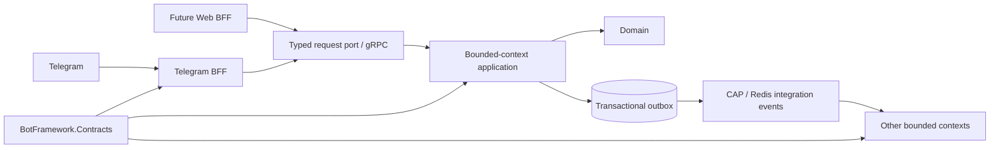

# ADR 0001: BFF and service boundaries

## Status

Accepted for incremental implementation.

## Context

The current process is a modular monolith with useful bounded contexts under
`Games.*`, but Telegram types enter those contexts through application handlers,
scheduled notification jobs, and the shared SDK. Splitting this shape into several
processes without first removing transport dependencies would create a distributed
monolith: deployments would be separate while contracts and release cadence remained
tightly coupled.

## Decision

Telegram is an external client adapter, not an application layer dependency.

- `CasinoShiz.TelegramBff` owns Telegram updates, callbacks, formatting, message IDs,
  and Telegram API retries.
- Backend bounded contexts expose typed commands and queries through
  `BotFramework.Contracts` abstractions.
- gRPC is the first remote implementation of the command/query request port.
- CAP with Redis remains the asynchronous integration-event transport. Events are
  facts, have no direct response, may fan out, and are consumed idempotently.
- PostgreSQL outboxes bridge committed state to integration events and outbound
  client notifications.
- Each deployable owns a small `Program.cs`. Common logging, health, tracing,
  configuration, and transport registration will live in a reusable hosting library;
  the current application host will not be copied into every service.

Commands, queries, and events are intentionally separate contracts. A generic
"everything is an event" envelope would hide ownership and delivery semantics and
make request/reply failures ambiguous.

Application code never selects or references a transport. It depends on bounded-
context interfaces such as `IDiceClient`, request/response records, and integration
event/handler contracts. Only a composition root selects an adapter:

- the monolith registers `InProcessDiceClient` and local request/event dispatchers;
- the Telegram BFF registers the gRPC implementation of `IDiceClient`;
- a future broker implementation can replace the local integration-event publisher
  without changing publishers or subscribers.

Generated protobuf types, gRPC channels, CAP types, and Redis APIs remain inside
transport projects. Integration events represent completed facts and their handlers
must tolerate duplicate delivery.

## Target dependency direction



`BotFramework.Contracts` contains no Telegram, database, CAP, Redis, ASP.NET, or gRPC
implementation dependencies. Transport projects depend on contracts, never the
reverse.

## Host strategy

There is no shared runtime host process. Every independently deployable unit has its
own composition root and lifecycle. A future `BotFramework.Hosting` package will
provide service-default extension methods only:

```csharp
builder.AddCasinoServiceDefaults();
builder.AddGrpcRequestTransport();
builder.AddCapIntegrationEvents();
```

This keeps configuration consistent without giving every service access to Telegram,
all game modules, or all infrastructure registrations.

## Migration sequence

1. Introduce Telegram-free messaging contracts and dependency tests.
2. Move one bounded-context use case behind a typed request handler.
3. Add an in-process request adapter to preserve current deployment behavior.
4. Add gRPC server/client adapters and run Telegram BFF as a separate process.
5. Move remaining Telegram handlers out of bounded-context application folders.
6. Extract contexts into services only when ownership, data, scaling, or deployment
   requirements justify the operational cost.

## Consequences

- The modular monolith remains deployable throughout migration.
- A context can move out of process without changing its logical handler contract.
- Client-specific response rendering stays in its BFF.
- Integration-event consumers must tolerate duplicates and version their contracts.
- Cross-context database reads must be replaced by APIs, replicated read models, or
  events before a context becomes an independent service.

## Implemented first slice

Dice is the reference migration:

- `Games.Dice.Contracts` contains the logical request/client contracts;
- `Games.Dice` contains backend application, domain, and persistence code and has no
  direct `Telegram.Bot` package reference;
- `Games.Dice.Telegram` contains the Telegram handler and adapter-only module;
- `Games.Dice.Transport.Grpc` owns protobuf wire contracts and both gRPC adapters;
- `CasinoShiz.Backend` exposes the Dice backend endpoint with Telegram disabled;
- `CasinoShiz.TelegramBff` loads only the Telegram adapter module and remote Dice
  client;
- `BotFramework.Host` owns backend composition and shared infrastructure without a
  direct `Telegram.Bot` dependency;
- `BotFramework.Telegram` owns webhook/polling, update routing and middleware,
  Redis update transport, and the Telegram outbox dispatcher;
- the legacy `CasinoShiz.Host` composes both modules and uses the local request
  transport, preserving the existing deployment during migration.

The native-dice group follows the same boundary: `DiceCube`, `Darts`, `Football`,
`Basketball`, and `Bowling` each have a dependency-free contracts assembly and a
separate Telegram adapter assembly. Their backend projects no longer reference
`Telegram.Bot`. Darts additionally exposes `IDartsRollDelivery`; its background
dispatcher depends on that port while the Telegram adapter owns the concrete dice
sender. The legacy monolith composes each backend module with its Telegram module.

`Games.NativeDice.Transport.Grpc` implements those same five contract interfaces
for the separate-process deployment. `CasinoShiz.Backend` maps its server endpoint;
`CasinoShiz.TelegramBff` resolves the interfaces to gRPC clients and loads only the
Telegram modules. Darts uses client-delivered rolls in remote composition and keeps
the queued Telegram delivery worker in a separate legacy-only adapter project.

`Games.Transfer` is also migrated end to end. Telegram-specific recipient
resolution (reply, text mention, or `@username`) remains in
`Games.Transfer.Telegram`; the backend receives only `ITransferService` arguments.
The monolith binds the interface locally, while `Games.Transfer.Transport.Grpc`
provides the separate-process implementation.

`Redeem` uses a dedicated `IRedeemClient` rather than exposing its internal service.
Its CAPTCHA challenge has contract-owned DTOs; verification remains authoritative on
the backend. Timeout scheduling and Telegram keyboards live in the Telegram adapter,
while local and gRPC clients share the same contract.

`Leaderboard` exposes read models and daily-claim results through
`ILeaderboardClient`. Telegram formatting, admin gating, help text, and message
chunking stay in the adapter. Backend aggregation and the daily-bonus service are
available through local and gRPC implementations without exposing host economics
types to the BFF.

`PixelBattle` has two client adapters. `Games.PixelBattle.Telegram` only opens the
WebApp. The canvas communicates directly with backend HTTP/SSE endpoints backed by
`IPixelBattleService`; adding a gRPC hop would provide no isolation benefit. Grid,
update, authentication, and option DTOs live in a dependency-free contracts assembly,
and WebApp static assets are owned by the module and published by both compositions.

`Pick` exposes only interactive operations through `IPickClient`; lottery settlement
and sweepers remain backend-only. Double-or-nothing chain state is also backend-owned,
with atomic claim/restore calls across gRPC, so callbacks remain safe with multiple
BFF replicas. The three Telegram handlers share one client contract while backend
services retain their narrower internal interfaces.

`Blackjack` keeps hand state, idempotent start operations, and settlement in the
backend behind `IBlackjackClient`. Telegram message IDs are explicit contract state,
while card rendering and inline keyboards live only in `Games.Blackjack.Telegram`.
The same client is implemented locally and through its typed gRPC endpoint.

`Horse` exposes betting, race execution, result lookup, and Telegram file-id
acknowledgement through `IHorseService`. Manual races return their rendered payload
through local/gRPC adapters. Scheduled races depend on `IHorseRaceNotifier`: the
backend implementation publishes a semantic completion event, while the legacy
Telegram adapter sends GIFs and delayed winner announcements directly.

`Challenges` exposes user lookup and the create/accept/decline/complete lifecycle
through `IChallengeService`, implemented locally in the monolith and over gRPC in
the split deployment. Telegram command, callback, dice animation, and result
formatting live in `Games.Challenges.Telegram`. Shared Blackjack hand rules are in
`Games.Blackjack.Contracts`; Horse GIF generation is isolated in
`Games.Horse.Rendering`, so the Challenges adapter does not depend on either game
backend. Challenge persistence and settlement remain authoritative in the backend.

`Meta` keeps seasons, profiles, achievements, quests, clans, tournaments, risk
controls, projections, scheduled jobs, and persistence in the backend. Its domain
DTOs and service interfaces live in `Games.Meta.Contracts`; command/menu rendering
and `/mystats` live in `Games.Meta.Telegram`. `Games.Meta.Transport.Grpc` adapts the
same Meta interfaces for the split deployment. Wallet, daily-bonus, and
player-protection calls are no longer part of the Meta transport. The legacy host
composes the backend and Telegram modules in process.

`Admin` keeps privileged wallet mutations, user lookup, stuck-bet cleanup, chat
queries, migrations, and persistence in the backend. Telegram commands and HTML
rendering live in `Games.Admin.Telegram`; `Games.Admin.Transport.Grpc` adapts
`IAdminService`, the read-only chat query contract, and the framework analytics
query contract for the separate BFF. The backend project depends only on the Darts
contract assembly for persisted round statuses, not on the Darts implementation.

`Poker` and `SecretHitler` keep their domain models and local service ports in
dependency-free contracts assemblies, while Telegram handlers and board rendering
live in dedicated adapter assemblies. Persistence, settlement, migrations, and
backend cleanup jobs remain in the bounded-context projects. The legacy host
composes both halves locally. Dedicated gRPC adapters expose the same service ports
to the split backend and Telegram BFF, including Poker timeout operations.

## Identity and wallet extraction

Identity and wallet are the first shared capabilities that can be selected as local
implementations or remote services without changing application code:

- `IPlayerDirectory`, economics, daily-bonus, and player-protection interfaces are
  compiled into `BotFramework.Contracts` and contain no database, Telegram, or gRPC
  types;
- `CasinoShiz.Identity` owns the PostgreSQL player directory implementation and its
  migration; Telegram ingress only supplies observed identity data through the port;
- `CasinoShiz.Identity.Transport.Grpc` and `CasinoShiz.Wallet.Transport.Grpc` own
  remote adapters;
- `CasinoShiz.IdentityService` and `CasinoShiz.WalletService` are standalone
  composition roots;
- `CasinoShiz.Backend` uses local implementations by default. Setting
  `Services:Identity:Mode` or `Services:Wallet:Mode` to `Grpc` replaces only the
  infrastructure adapter;
- `CasinoShiz.TelegramBff` may point each capability at a separate address, with the
  main backend address as the compatibility default.

Wallet account and ledger analytics now use `IWalletReadService` and
`IWalletAnalyticsService`; game contexts no longer query the legacy `users` or
`economics_ledger` tables. Wallet SQL is confined to wallet-owned infrastructure.
The remaining compatibility surface is the original Razor admin UI. Backend compiles
and executes these pages (including their local operational SQL), while Admin BFF is
the authenticated browser ingress and reverse proxy in a split deployment.

`CasinoShiz.AdminBff` is the separate browser composition root. It has no database
configuration: login/logout and server-side browser session stay local, and other
`/admin/*` requests are forwarded to Backend with internal authentication and actor
headers. The legacy page source remains singular under `CasinoShiz.Host/Pages/Admin`
and is linked into Backend, not copied into AdminBff. Individual pages can migrate to
logical owner contracts without changing the public admin routes.
