# CasinoShiz Architecture

This document is a diagram-first view of the current CasinoShiz architecture.
For feature details and configuration keys, see [docs.md](docs.md). For operational
procedures, see [operations.md](operations.md).

## Repository Boundaries

```text
framework/
  BotFramework.Contracts/   transport-neutral messaging contracts
  BotFramework.Sdk/         module and domain abstractions
  BotFramework.Host/        backend infrastructure and composition
  BotFramework.Rendering/   bounded render queues + media artifact/history ports
  BotFramework.Telegram/    Telegram ingress, routing and delivery
  BotFramework.Discord/     Discord gateway, interactions and delivery
games/
  Games.X.Contracts/        logical interfaces and portable DTOs
  Games.X/                  backend application/domain/infrastructure
  Games.X.Telegram/         Telegram presentation adapter
  Games.X.Discord/          Discord presentation adapter
  Games.X.Transport.Grpc/   protobuf and remote adapters
host/
  CasinoShiz.Host/          combined compatibility deployment + Razor admin
  CasinoShiz.Backend/       Telegram-free backend process
  CasinoShiz.TelegramBff/   Telegram client process
  CasinoShiz.DiscordBff/    Discord client process
  CasinoShiz.AdminBff/      browser admin BFF without database access
tests/CasinoShiz.Tests/     behavior and dependency-boundary tests
```

Not every context requires every optional project. PixelBattle uses HTTP/SSE for
its WebApp, native-dice contexts share `Games.NativeDice.Transport.Grpc`, and
Horse rendering is isolated in `Games.Horse.Rendering`. See
[`games/README.md`](../games/README.md) for the ownership rules.

## System Context

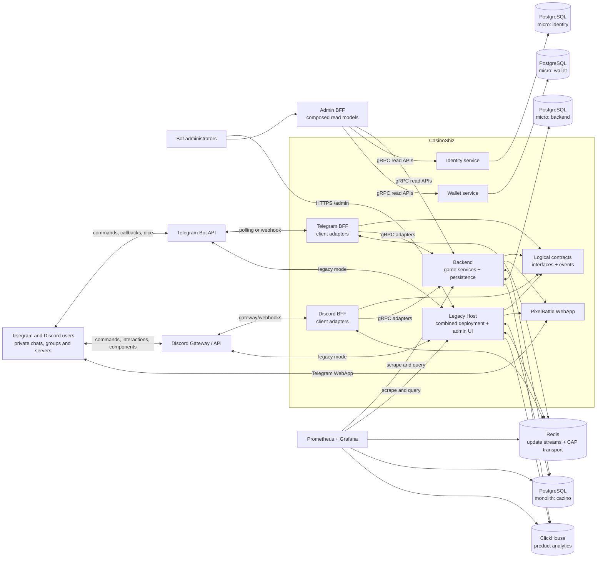

The repository supports one codebase across four deployment shapes: the combined
compatibility host, the legacy microservices profile, the distributed per-game
Compose profile, and Kubernetes/Helm. `CasinoShiz.Host` keeps the existing
monolith path; BFFs and Backend can be split without changing logical contracts.
A bounded context can therefore remain in-process, run as a dedicated game
service, or cross a gRPC boundary without changing its application-facing API.

## Runtime Containers

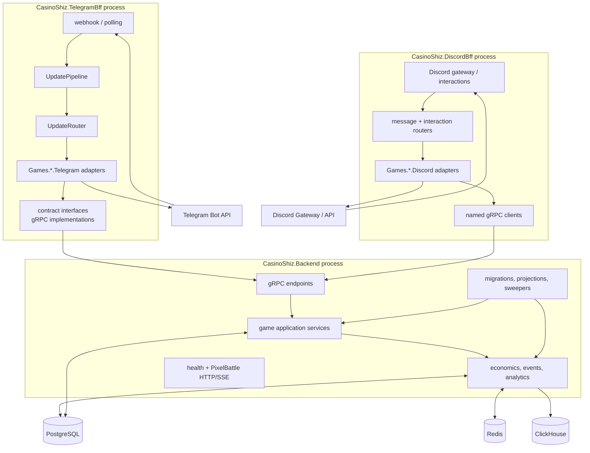

The BFF processes contain channel-specific ingress, UX and presentation only.
They call Backend through logical contracts and named gRPC clients; they do not
open game, Identity or Wallet databases. Backend instances may be the combined
all-games process, a legacy service, or one module-selected game process.

## Host Composition

Each composition root selects backend modules, Telegram adapters, Discord adapters,
or any combination of them. Backend modules own persistence, migrations and jobs;
channel adapters own handlers, UX and client presentation. Transport registration
belongs only to Backend/BFF programs.

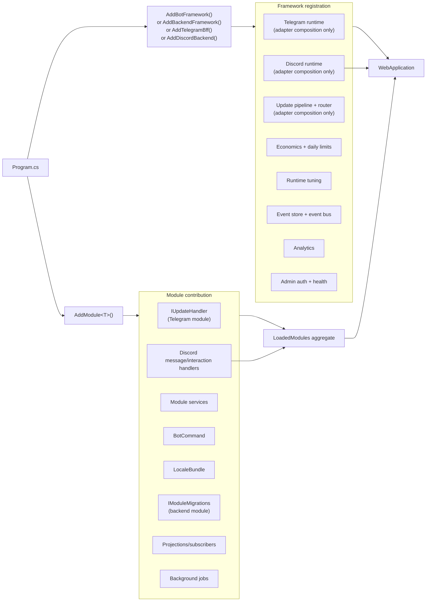

Current module families:

- Telegram dice: slots, dice cube, darts, football, basketball, bowling;
- stateful games: blackjack, poker, Secret Hitler, horse racing;
- social and utility: challenges, pick/lotteries, transfer, redeem, PixelBattle;
- shared views: leaderboard, seasonal meta, admin and debug.

## Telegram Update Flow

Inside `BotFramework.Telegram`, polling and webhook delivery use the same processing
pipeline. This runs in `CasinoShiz.TelegramBff` or in the combined legacy Host.
Redis changes ingestion delivery, not the handler or logical client contracts.

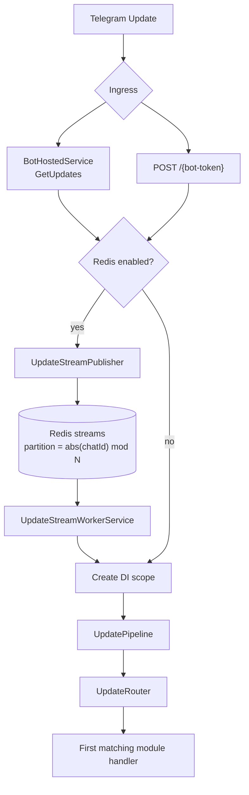

### Pipeline And Routing

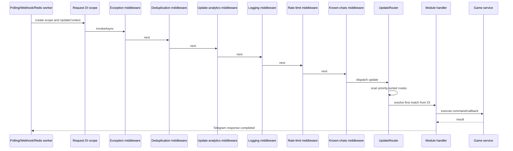

The effective middleware list is assembled by the framework registrations.
Routing attributes have descending priority:

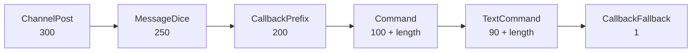

Only the first matching route is dispatched. Longer command names win ties, so
`/picklottery` takes precedence over `/pick`.

## Discord Interaction Flow

Discord has a separate gateway and interaction pipeline, but it stops at the same
logical application boundary as Telegram. The adapter owns Discord-specific
parsing and presentation; game commands, decisions, effects and events remain
channel-neutral.

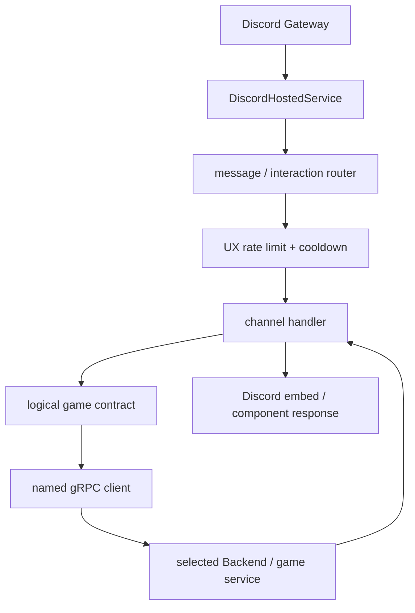

The router handles slash commands, autocomplete, buttons, selects and modals.
Multi-field input such as a table code, bet or raise amount is collected with a
modal. `DiscordEmbeds` renders structured responses and `DiscordLocalization`
provides RU/EN text. Rate limiting and cooldown checks run before the handler,
while the Backend executor remains authoritative for idempotency and state
concurrency.

Component custom IDs use persistent component tokens. A token is validated before
the component or modal handler runs, so a button created before a restart is
rejected as stale rather than being applied to a new process state. Discord
outbound messages use a durable outbox and can be claimed by any healthy BFF
replica. Discord integration tests exercise these routes with mock interaction
objects, including autocomplete, modal submission, localization and stale-token
rejection; they do not require a live Discord gateway.

## Redis Update Delivery

Redis Streams preserve per-chat ordering by assigning the same chat to the same
partition. Different partitions can execute concurrently.

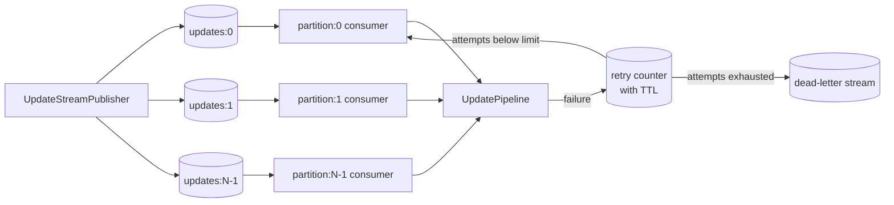

An entry is acknowledged only after successful pipeline processing. Failed entries
remain pending and are retried. After `MaxProcessingAttempts`, the payload and error
metadata are moved to the dead-letter stream and the original entry is acknowledged.

## Module Request Pattern

Most command paths follow the same dependency direction:

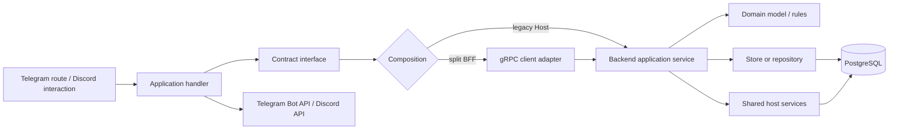

Handlers live in `Games.*.Telegram` or `Games.*.Discord`, parse channel input, and
render channel responses. They know a logical interface, not whether it is local
or remote. Backend services own orchestration; domain objects own rules; stores
own persistence. Protobuf and generated clients remain in transport projects;
channel SDKs remain in channel adapters. Cross-cutting balance, analytics, tuning,
locking, and event behavior belongs to framework services.

## Atomic Execution Kernel And Effect System

The module contract and registration  are documented in
[`framework/README.md`](../framework/README.md#atomic-game-execution-and-effects).

Game and economy commands use one linear execution kernel. Deployment transport
does not change the command semantics: monolith calls and BFF-to-gRPC calls both
arrive at the same `IAtomicGameExecutor<TCommand,TState,TResult>`.

```mermaid
flowchart LR
    request["Telegram / Discord / gRPC / HTTP request"]
    envelope["Framework envelope<br/>stable command id"]
    transaction["PostgreSQL transaction"]
    locks["Sorted advisory locks<br/>command + aggregate + wallets + quotas"]
    inbox{"Command inbox"}
    snapshots["State + wallet + quota snapshots<br/>UTC time + named entropy"]
    decide["Pure IGameAction.Decide"]
    plan["Materialized GameEffectPlan<br/>validation + grouping"]
    apply["Deterministic effect pipeline"]
    commit["Inbox result + commit"]
    delivery["Outbox dispatch<br/>events + schedules"]

    request --> envelope --> transaction --> locks --> inbox
    inbox -->|"duplicate"| commit
    inbox -->|"new"| snapshots --> decide --> plan --> apply --> commit
    commit --> delivery
```

The game action is synchronous and has no infrastructure dependencies. It sees
only the command, loaded state, snapshots, named entropy and framework time. It
returns a `GameDecision` containing the new state, public result and complete
materialized effect lists. Randomness, clocks, database reads, analytics calls,
Telegram/Discord sends and service resolution do not occur inside `Decide`.

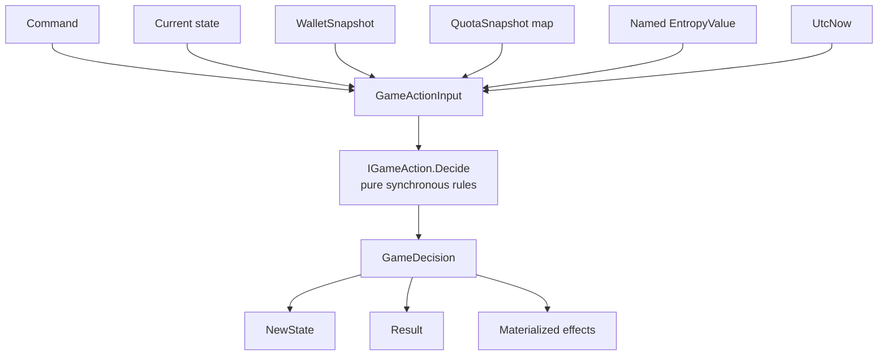

### Effect lanes

Effects are typed data, not callbacks, tasks, or lazy streams. Before the first
mutation, `GameEffectPlan` verifies that effects are valid for the decision,
declared quotas exist, and record/custom effect types each have exactly one
registered writer or handler.

```mermaid
flowchart LR
    decision["Accepted GameDecision"]

    protection["Player protection"]
    primary["EconomyEffect<br/>primary wallet + ledger"]
    quota["QuotaEffect<br/>consume / restore / grant"]
    aggregate["Aggregate state store"]
    records["IGameRecord writers"]
    custom["Typed custom effects<br/>including multi-wallet"]
    eventOutbox["Domain event outbox"]
    scheduleOutbox["Schedule outbox"]
    inboxResult["Serialized inbox result"]
    pg["COMMIT"]

    decision --> protection --> primary --> quota --> aggregate --> records --> custom
    custom --> eventOutbox --> scheduleOutbox --> inboxResult --> pg
```

The lanes have distinct ownership:

| Lane | Owner and invariant |
|---|---|
| `EconomyEffect` | Framework primary wallet; protected debit, balance and append-only ledger stay consistent |
| `WalletEconomyEffect` | Framework multi-wallet handler; all target wallet locks are declared before `Decide` |
| `QuotaEffect` | Framework quota store; configured capacity and usage change atomically with the command |
| aggregate state | Module state store operating through `IGameExecutionContext` |
| `IGameRecord` | Module history writer; preserves synchronous history consistency where required |
| custom `IGameEffect` | One explicitly registered typed handler; no raw connection/transaction exposure |
| `IDomainEvent` | Framework outbox; analytics and remote reactions happen after commit |
| `ScheduleEffect` | Framework schedule outbox; Quartz work is created or cancelled durably |

`IAsyncEnumerable<IGameEffect>` is intentionally not used. A lazy effect stream
could throw after partial enumeration, depend on I/O timing, or produce different
effects on retry. The decision is a finite value that can be validated before
mutation. Npgsql work inside one transaction remains sequential; concurrency is
achieved between independent commands rather than by issuing simultaneous
operations on one connection.

### Workflow effects and Quartz semantics

Workflow mutations that do not have a user-facing `IGameAction` (quest progress/claims,
tournament lifecycle transitions and season payouts) use the SDK's
`IAtomicEffect` plus Host `IAtomicEffectExecutor`. The executor takes stable locks,
checks the command inbox, resolves one typed handler per effect, and commits the
result, ledger/history changes and outbox rows in one PostgreSQL transaction.
Handlers receive a restricted `IAtomicEffectContext`; they never receive a
connection, transaction or DI container. This keeps scheduled settlement and
interactive commands on the same idempotent mutation path.

Quartz is deliberately only the trigger and persistent schedule coordinator. A
`ScheduleExecutionPolicy` is attached to a schedule rather than encoded in a job:

| Policy | Meaning |
| --- | --- |
| `Misfire` | `FireOnce` catches up once, `Ignore` replays missed fires, `DoNothing` skips them |
| `Concurrency` | `Disallow` serializes one job key; `Allow` permits overlapping runs |
| `BatchSize` | bounded work hint passed to the scheduled command as `batch-size` |
| `MaxAttempts` / `RetryBackoff` | bounded Quartz job retries before the failure is surfaced |

The command must still use an atomic/effect executor. Quartz retries therefore
retry the same idempotent command semantics, while rendering, ClickHouse analytics
and Telegram delivery remain asynchronous post-commit consumers.

### Long-lived tournament workflow

Tournament commands use the framework's `BotFramework.Host.Workflows` boundary in
the Backend. `ITournamentService` keeps the existing public contract, but command
execution is routed through `ITournamentWorkflow`; the workflow handler delegates
the actual local transition to `TournamentCommandExecutor` and the existing
`IAtomicEffectExecutor`. The framework owns the Wolverine adapter, correlation,
durable step delivery, partitioning, replay and persisted generic saga state.

After a local effect commits, the handler uses `IDurableWorkflowStepExecutor` to
emit a `DurableWorkflowStep` through the framework. `durable_workflow_steps` is an
audit and recovery projection with `workflow_id`, `command_id`, `command_type`,
`causation_id`, the full original `command_json`, result, status, terminal marker
and payload. A bounded
facade wait returns a typed result when the command finishes quickly; otherwise it
returns `Pending` for the user-facing create/join/report contracts while the durable
command continues in the background.

The split Wallet boundary is explicit. Join debits, prizes and cancellation refunds
are applied through `IWalletAtomicExecutionService` before the local tournament
transition, using stable Wallet operation ids. If the local transition is definitively
rejected, a compensating credit/debit is sent with a `.rollback` reason. If the
process fails after the Wallet step but before the local commit, the framework
retry policy retries the same command and the Wallet operation id plus AtomicEffect
inbox make the retry safe. The domain tables, AtomicEffect inbox and CAP event
outbox remain the source of domain truth; the workflow table is the operator-visible
recovery timeline.

The admin tournament page is deliberately a control plane, not a second mutation
engine: SuperAdmin can inspect command/result JSON and replay a failed or non-terminal
step. Replay reuses the original command id. Telegram/Discord client outboxes and
the CAP domain-event outbox remain unchanged.

### Aggregate and lock scope

The descriptor maps a command to its consistency boundary. Commands sharing any
lock serialize; commands with disjoint lock sets can execute in parallel.

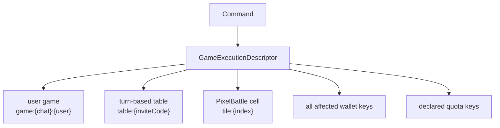

Examples:

- Dice uses a user/game aggregate plus its wallet and daily quota.
- Challenges, Transfer, Horse and completed table games declare every debit or
  payout wallet, allowing a single atomic multi-wallet commit.
- Blackjack, Poker and Secret Hitler serialize transitions by table/game id.
- PixelBattle uses a tile aggregate. Writes to one tile are ordered while writes
  to different tiles remain parallel; the full grid is a read model, not a
  global mutation lock.

### Commit, retry and external work

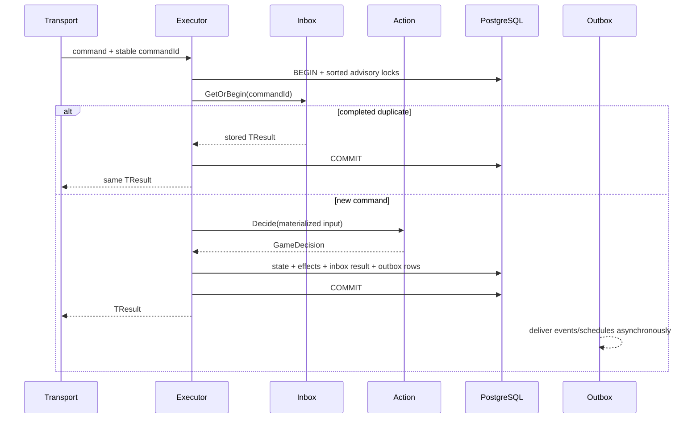

Cancellation or failure before commit rolls back every transactional lane. If a
response is lost after commit, retrying the same command id returns the stored
result without repeating effects. A fresh command id is a new command, so the
stable id should come from Telegram update identity, Discord interaction/component
identity, gRPC metadata, or an HTTP idempotency header.

Analytics, ClickHouse writes, CAP publication, Telegram/Discord notifications and other
remote operations are not transactional custom effects. They consume committed
domain events/outbox records. Live transports may broadcast after the executor
returns; PixelBattle additionally sends periodic full-grid snapshots so an
ephemeral SSE broadcast loss self-heals.

The legacy `IEconomicsService` remains a compatibility facade for non-command
and administrative paths. New game mutations should use the execution kernel;
read-only queries should continue to use owning-context read services directly.

## Render Runtime And Match Media

GIF and image generation is isolated from the atomic executor. The executor
commits rules, balances, state and effects before any CPU-heavy render begins.
Both deployment shapes compose `BotFramework.Rendering`; split processes share
the same content-addressed MinIO bucket.

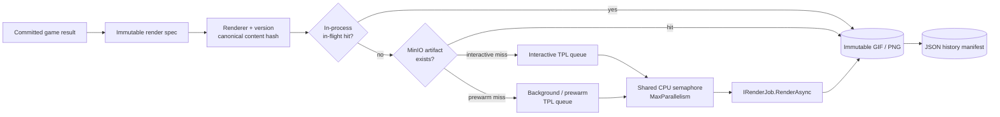

The two bounded `ActionBlock` queues provide backpressure and priority separation,
while one semaphore enforces the process-wide render CPU budget. Identical work
inside a process shares one task. Across processes the stable object key makes
duplicate output harmless and subsequent requests become cache hits.

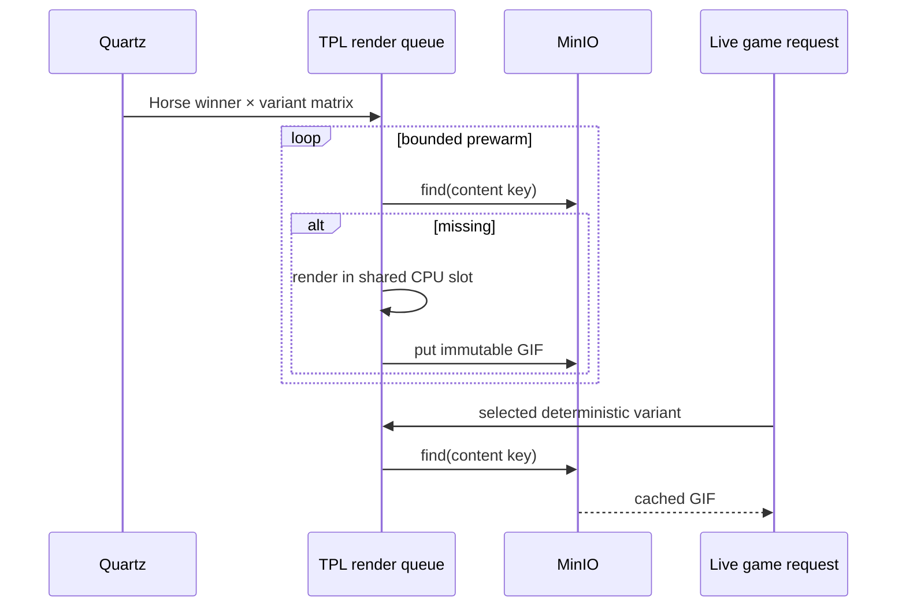

Horse prewarming is a Quartz recurring scheduled command, not an unbounded
background loop. Poker board images use on-demand content deduplication. Match
history stores manifests referencing immutable objects, so repeated views do not
duplicate media bytes. Admin history/artifact reads are exposed only under the
existing protected `/admin` surface.

MinIO is deliberately outside PostgreSQL transactions. If it is unavailable,
the current request receives a transient freshly rendered artifact, storage
failures are metered/logged, and the committed game result is not rolled back.
Artifact history therefore has operational durability, not domain consistency;
PostgreSQL remains the source of truth for wallets, ledgers and match state.

## Wallet And Ledger

The logical wallet/protection ports live in `BotFramework.Contracts`. Identity uses
the separate `IPlayerDirectory` port. Composition chooses their implementation:

- combined host/backend: local PostgreSQL services;
- split deployment: `CasinoShiz.IdentityService` and `CasinoShiz.WalletService`
  reached through adapters in `*.Transport.Grpc`;
- Telegram and Discord BFFs: always consume the logical ports and do not know
  whether their target is the main backend or a dedicated service.

Backend selection is configured with `Services:{Identity|Wallet}:Mode` (`Local` or
`Grpc`) and `Address`. The BFF accepts independent
`Services:{Identity|Wallet}:Address` values and falls back to
`Backend:GrpcAddress`. Transport choice therefore stays in composition roots.

Wallet account reads now cross `IWalletReadService`; ledger and operational
aggregates cross `IWalletAnalyticsService`. Game contexts no longer query the
compatibility `users` or `economics_ledger` tables. SQL for those tables is confined
to wallet-owned infrastructure. Legacy Razor admin pages are compiled into Backend
as a compatibility surface. In a split deployment the browser reaches them only
through Admin BFF, so the existing operator UI remains intact while pages migrate
to owning-context contracts incrementally.

### Physical data ownership

The microservices deployment makes the logical boundaries physical. Each service
has its own PostgreSQL database and migration set:

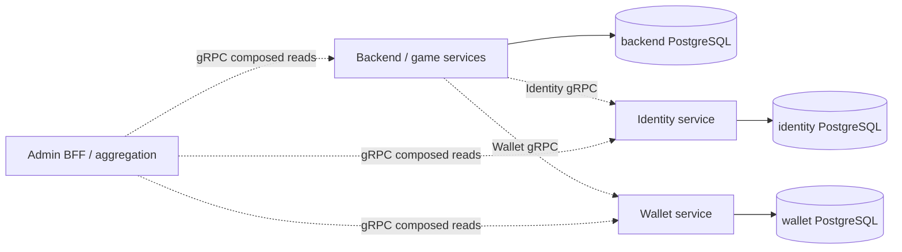

Backend may read only Backend-owned tables in microservices mode. Identity and
Wallet start with their own connection strings and execute only their migrations;
neither service depends on the compatibility `cazino` database. The monolith
profile intentionally keeps the existing shared `postgres/cazino` database for
backward compatibility, while service boundaries remain contract-level.

No cross-database joins or shared-table reads are allowed. A player or admin view
that needs several contexts is a composed read model assembled by Admin BFF from
Identity, Wallet and Backend APIs. Writes follow the same rule: the owning service
validates and mutates its own data, and other services receive commands or events.

## Admin BFF

`CasinoShiz.AdminBff` owns browser login/session state and registers no database
connection. After authentication it reverse-proxies `/admin/*` (except login and
logout) to Backend, adding the internal operations key and authenticated actor.
Backend validates those headers, creates the legacy server session, and executes
the original Razor pages and their antiforgery-protected actions.

The proxy implementation is YARP. External gRPC clients are created through the
shared resilient client factory in `CasinoShiz.ServiceDefaults`; composition roots
also use that project for OpenTelemetry and common health registration.

Admin BFF is also the aggregation boundary for cross-service read models. Typical
views are composed through APIs such as:

```text
GET /api/aggregation/players/{userId}
  -> Identity player/profile data
  -> Wallet balance/protection data

GET /api/aggregation/admin
  -> Backend operations data
  -> Wallet analytics data
```

The response is assembled in the BFF from gRPC clients. It is not a SQL join and
does not expose another service's tables. Backend, Identity, Wallet and both
channel BFFs expose liveness/readiness checks; readiness includes only the
dependencies owned or required by that process.

The first migrated vertical slice contains wallet inspection, idempotent balance
adjustment and identity lookup. Each rendered adjustment carries a stable operation
ID, so repeating the same browser POST cannot apply the ledger mutation twice.
Service failures are reported per page rather than taking down unrelated sections.

The old `CasinoShiz.Host/Pages/Admin` remains the single compatibility UI source and
is linked into Backend at build time; it is not duplicated in AdminBff. A page can
later move behind an owning-context contract after its read/mutation contract and
server-side audit semantics exist.

The current compatibility wallet identity is `(telegram_user_id, balance_scope_id)`.
Identity maps external channel identities to the logical player id; the balance
scope is normally the originating chat/server scope, so one person can have
independent balances in different groups, servers and private chats.

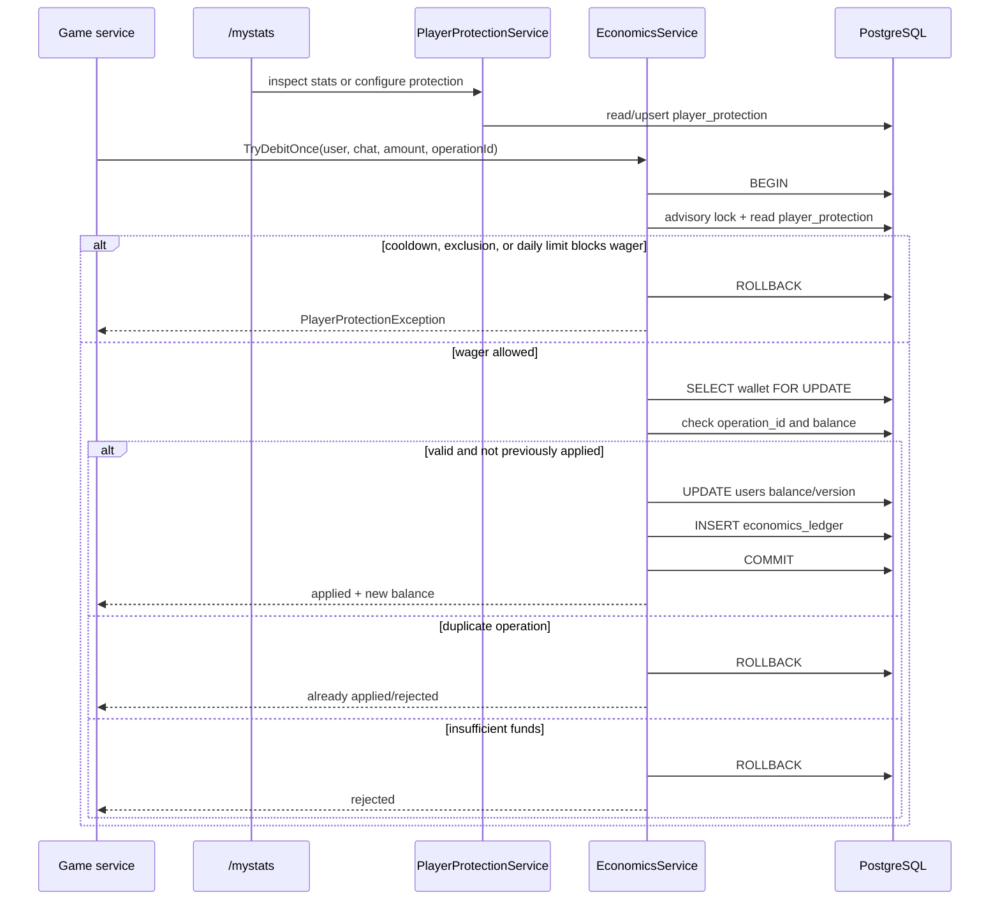

Important guarantees:

- `SELECT ... FOR UPDATE` serializes concurrent mutations to one wallet;
- wallet update and ledger append happen in one transaction;
- operation ids make critical debits, credits, transfers, refunds, and prizes idempotent;
- the ledger is append-only; admin recovery writes compensating rows.
- `PlayerProtectionService` reads player statistics and configures daily stake limits,
  cooldowns, and self-exclusion through `/mystats`;
- `EconomicsService` enforces those controls transactionally before protected wager
  mutations, while administrative, transfer, and rollback reasons are exempt.

## Event-Sourced Aggregate Flow

Event-sourced modules persist aggregate events first. Dispatch happens after append
commit, then updates read models, cross-module subscribers, and analytics.

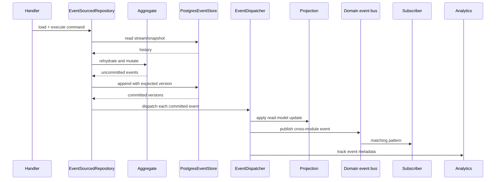

Dispatch is post-commit. A projection/subscriber failure does not roll back the event
append. Failures are persisted for retry, and event replay can rebuild projections.

## Domain Event Bus Modes

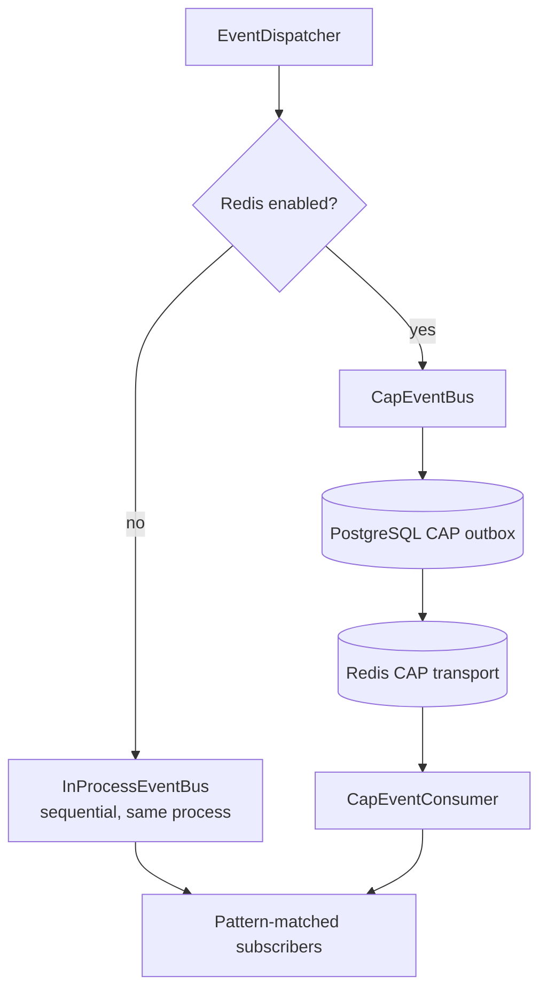

Subscriptions use event-name patterns such as `sh.game_ended`, `sh.*`,
`*.game_ended`, or `*`. Subscribers must be idempotent because distributed
delivery is at least once.

In distributed mode the transactional source is the Backend-owned
`game_event_outbox`. A lease-based dispatcher publishes committed rows through
the CAP PostgreSQL outbox into Redis Streams; consumers then update only their
local projections or call another service API. `Backend:ServiceName` determines
the logical consumer group: replicas of `game-poker` share one group and load
balance, while `game-poker` and `game-dice` receive independent fan-out copies.

Schedules use the same transactional boundary but different ownership. Every
`game_schedule_outbox` row carries `game_id`; a worker claims only rows for
modules loaded by its service. Quartz uses `Backend:ServiceName` as the persistent
`sched_name` partition, so replicas of one game cluster together and cannot acquire
another game's triggers. The monolith keeps the legacy `CasinoShiz` scheduler name.

## Telegram Outbox

Critical Telegram messages emitted outside the live update response path are
persisted before sending. This covers event subscribers and background jobs where
`DB/event -> Telegram side effect` should survive process restarts and transient
Telegram failures.

```mermaid
flowchart LR
    subscriber["Event subscriber / job"]
    api["ITelegramOutbox"]
    table[("telegram_outbox")]
    mode{"TelegramOutbox:Transport"}
    dispatcher["Local dispatcher"]
    relay["Backend CAP relay"]
    cap["CAP / Redis"]
    bff["Telegram BFF"]
    bot["Telegram Bot API"]

    subscriber -->|"EnqueueAsync<br/>optional dedupe_key"| api
    api --> table
    table --> mode
    mode -->|"Local"| dispatcher
    mode -->|"Cap"| relay
    dispatcher -->|"claim due rows<br/>FOR UPDATE SKIP LOCKED"| table
    dispatcher -->|"SendMessage"| bot
    bot -->|"message id"| dispatcher
    dispatcher -->|"mark sent / schedule retry"| table
    relay -->|"claim due rows"| table
    relay -->|"delivery command"| cap
    cap --> bff
    bff -->|"SendMessage"| bot
    bff -->|"delivery receipt"| cap
    cap -->|"mark sent"| table
```

`dedupe_key` suppresses duplicate enqueues from repeated event handling. Both
delivery modes reclaim expired leases; the CAP mode records `telegram_message_id`
only after the Telegram BFF receipt. Telegram itself has no idempotency key, so
notifications must still tolerate at-least-once delivery. Live handler replies,
validation errors, menus, and other immediate user interactions still use direct
`ctx.Bot.SendMessage(...)` calls.

## Discord Outbox

Discord interaction responses can be immediate, but notifications and deferred
messages are persisted in `discord_outbox` before delivery. Discord BFF replicas
claim due rows with leases, retry transient failures, and preserve a deduplication
key. This keeps delivery independent from the interaction request and makes the
same outbox safe for combined, split and horizontally scaled deployments.

```mermaid
flowchart LR
    handler["Discord handler / event subscriber"]
    outbox["discord_outbox"]
    claim["lease claim<br/>FOR UPDATE SKIP LOCKED"]
    bff["Discord BFF replica"]
    api["Discord API"]
    retry["retry metadata / expired lease"]

    handler --> outbox --> claim --> bff --> api
    api -->|"success"| outbox
    bff -->|"transient failure"| retry --> outbox
```

## Seasonal Meta Projections

Game modules publish `meta.game_completed`. The Meta module projects the event into
several independent features.

```mermaid
flowchart LR
    completed["GameCompletedMetaEvent"]

    xp["MetaXpProjection"]
    quests["QuestProjection"]
    clans["ClanProjection"]

    profile[("season player<br/>XP, level, rating, totals")]
    achievements[("player achievements")]
    risk[("risk flags")]
    questProgress[("daily/weekly quest progress")]
    clanProgress[("season clan XP/rating")]

    completed --> xp
    completed --> quests
    completed --> clans

    xp --> profile
    xp --> achievements
    xp --> risk
    quests --> questProgress
    clans --> clanProgress
```

`/menu`, `/profile`, `/quests`, `/achievements`, `/clan`, and `/topseason`
read these projections. Tournament brackets are part of the same module but use
their own command-driven tables and idempotent economics operations.

## Runtime Tuning

Runtime settings are a database overlay on top of file and environment
configuration.

```mermaid
flowchart LR
    file["appsettings.json"]
    env["Environment variables"]
    admin["Admin structured forms<br/>or JSON patch"]
    registry["Registered typed sections"]
    strict["Strict JSON merge<br/>unknown fields rejected"]
    validation["IConfigurationValidator&lt;T&gt;<br/>FluentValidation adapter"]
    adminEffects["AdminEffectPlan<br/>transaction + mandatory audit"]
    table[("runtime_tuning.payload")]
    accessor["RuntimeTuningAccessor"]
    effective["Effective typed options"]
    games["Game/framework services"]

    file --> accessor
    env --> accessor
    registry --> strict
    admin --> strict
    strict --> validation
    validation --> adminEffects
    adminEffects --> table
    table --> accessor
    accessor --> effective
    effective --> games
```

Precedence is:

1. `appsettings.json`;
2. environment variables;
3. whitelisted database patch.

`BindOptions<TOptions, TValidator>` registers one section for both startup and
runtime validation. The SDK owns only `IConfigurationValidator<TOptions>` and
structured issues; the Host supplies a FluentValidation bridge and
`ValidateOnStart`. Admin JSON is not a loose property bag: the registry rejects
unregistered sections, strict deserialization rejects unknown nested properties,
and semantic validators run against the fully merged effective options. Preview
and apply therefore share exactly the same validation path.

Saving from `/admin/settings` produces a `RuntimeConfigurationPatchEffect`. The
admin execution kernel applies that effect and appends `admin_audit` in the same
PostgreSQL transaction; after commit the runtime accessor reloads the normalized
patch. Services that read `IRuntimeTuningAccessor` receive changes without process
restart. Failed validation performs no writes, and a failed effect rolls back both
the mutation and audit.

## Administrative Effect Coverage

Administrative commands use the same finite, typed-effect discipline as games. The
Razor pages and `Games.Admin` Telegram service build an `AdminExecutionEnvelope`
and `AdminEffectPlan<TResult>`; they do not open their own mutation connection or
transaction. The Host resolves one handler per effect, applies it with the current
transaction-aware context, appends `admin_audit`, and commits once.

```mermaid
flowchart LR
    users["Users page"] --> wallet["WalletAdjustmentAdminEffect"]
    ledger["Ledger page"] --> revert["LedgerRevertAdminEffect"]
    admin["Games.Admin"] --> adminEffects["ClearChatBets / DisplayNameOverride"]
    meta["Meta seasons / alerts / quests"] --> metaEffects["MetaSeason* / MetaAlertStatus / MetaQuestCatalog*"]
    wallet --> executor["AdminEffectExecutor<br/>one PostgreSQL transaction"]
    revert --> executor
    adminEffects --> executor
    metaEffects --> executor
    executor --> state[("wallets, ledger, game/meta tables")]
    executor --> history[("meta_event_log")]
    executor --> audit[("admin_audit")]
```

The migrated administrative surface is intentionally explicit:

- Users adjusts a wallet and appends its ledger line; `operation_id` makes retries
  idempotent.
- Ledger reversal locks the source and wallet rows, checks prior compensation, and
  writes the correction atomically.
- Games.Admin clears pending DiceCube/Darts/Football/Basketball/Bowling bets with
  refunds, or changes a display-name override, without a second mutation path.
- Meta season creation/preparation/activation/finish/configuration and player/clan
  rewards are effects. Rewards use deterministic operation ids and write
  `meta_event_log` in the same transaction. Alert status changes follow the same
  history path.
- Quest catalog save/reload are effects as well. Save uses a temp-file + atomic
  replace for the existing file-backed catalog; that filesystem operation is not
  rollbackable by PostgreSQL, so a database/object-store catalog remains the next
  hardening step.

Read-only queries may continue to use the existing stores and Dapper projections.
They are deliberately outside the executor and therefore cannot accidentally
create a partial admin mutation.

## Admin And HTTP Surface

```mermaid
flowchart TB
    request["HTTP request"]
    path{"Path"}

    health["/health/live<br/>/health/ready"]
    webhook["/{bot-token}<br/>production webhook"]
    pixel["/pixelbattle/*<br/>WebApp + API + SSE"]
    adminGate["/admin session gate"]
    login["login/auth/logout"]
    pages["Razor admin pages"]
    economy["Current economy snapshot"]
    jobs["Read-only background-job status"]
    recovery["/admin/recovery<br/>event + outbox records"]
    auditPage["/admin/audit<br/>CSV / JSON downloads"]

    token["Token form or<br/>Telegram Login Widget"]
    session["AdminSession<br/>SuperAdmin / ReadOnly"]
    audit[("admin_audit")]
    pg[("PostgreSQL operational state")]
    jobState["In-process job status snapshots"]

    request --> path
    path --> health
    path --> webhook
    path --> pixel
    path --> adminGate
    adminGate --> login
    login --> token
    token --> session
    adminGate -->|"authenticated"| pages
    pages --> economy
    pages --> jobs
    pages --> recovery
    pages --> auditPage
    economy --> pg
    jobs --> jobState
    recovery --> pg
    auditPage --> audit
    adminPlan["Typed AdminEffectPlan"]
    adminExecutor["Admin effect executor<br/>one transaction"]

    pages -->|"write actions"| adminPlan
    adminPlan --> adminExecutor
    adminExecutor --> pg
    adminExecutor --> audit
```

Read-only admins can inspect operational pages but mutation handlers return `403`.
SuperAdmin writes include balance changes, race actions, runtime tuning, and other
administrative operations. The dashboard economy snapshot and background-job table
are read-only operational views. `/admin/audit` returns browser downloads in CSV or
JSON while keeping the same role boundary as the on-screen audit view.

## Deployment Topology

### Docker Compose

The compose file exposes three application profiles. `monolith` runs
`CasinoShiz.Host` against the existing shared `postgres/cazino` database;
`microservices` runs Backend, Identity, Wallet, TelegramBff, DiscordBff, and
AdminBff as separate containers with physical service databases; `distributed`
runs one module-selected Backend per game and channel-specific BFFs. The
monolith and legacy microservices profiles are preserved. Internal calls use
service DNS names and gRPC; only composition and environment values differ
between deployment modes.

```bash
docker compose --profile monolith up --build
docker compose --profile microservices up --build
docker compose --profile distributed up --build
docker compose --profile microservices config
```

The last command is a safe topology check: it must resolve
`backend-postgres`, `identity-postgres` and `wallet-postgres` with independent
named volumes before the profile is started.

```mermaid
flowchart TB
    internet["Telegram / Discord / browser"]

    subgraph compose["Docker Compose network"]
        bot["Telegram + Discord BFFs"]
        postgres[("PostgreSQL 16<br/>profile-owned databases")]
        redis[("Redis")]
        clickhouse[("ClickHouse")]
        prometheus["Prometheus"]
        grafana["Grafana"]
        pgexporter["postgres-exporter"]
        redisexporter["redis-exporter"]
        cadvisor["cAdvisor"]
        monitor["dotnet-monitor"]
    end

    internet --> bot
    bot <--> postgres
    bot <--> redis
    bot --> clickhouse

    pgexporter --> postgres
    redisexporter --> redis
    monitor --> bot
    prometheus --> pgexporter
    prometheus --> redisexporter
    prometheus --> cadvisor
    prometheus --> monitor
    grafana --> prometheus
    grafana --> clickhouse
```

### Compose profile ownership and scaling

| Profile | Application shape | PostgreSQL ownership |
|---|---|---|
| `monolith` | `CasinoShiz.Host` with all selected modules and Telegram/Discord adapters | shared `postgres/cazino` for compatibility |
| `microservices` | all-games Backend + Identity + Wallet + channel BFFs + Admin BFF | `backend-postgres/backend`, `identity-postgres/identity`, `wallet-postgres/wallet` |
| `distributed` | one module-selected Backend per game + channel BFFs + Admin BFF | Backend game services share `backend-postgres`; Identity and Wallet retain their own databases |

The microservices profile enforces physical data ownership. Backend, Identity and
Wallet have separate connection strings, health checks and migration sets. BFFs
and Backend do not connect to another service's database; aggregation is performed
over gRPC APIs.

The distributed profile reuses the same Backend image and selects a module at
startup. For example:

```yaml
Backend__Modules: dice
Backend__ServiceName: game-dice
ConnectionStrings__Postgres: Host=backend-postgres;Database=backend
```

Channel BFFs route each logical game through `Backend:GameAddresses:<GameId>` and
fall back to `Backend:GrpcAddress` for a monolith or single Backend. Stable Compose
DNS names make replica changes an infrastructure operation:

```bash
docker compose --profile distributed up --build --scale game-poker=3
```

All Backend replicas use PostgreSQL advisory migration locks. Event outbox rows are
leased with `SKIP LOCKED`; schedule rows are claimed only by the service that owns
their `game_id`; Quartz partitions triggers by `Backend:ServiceName`. Therefore
replicas load-balance one logical game service without executing another game's
migrations or scheduled work.

### Kubernetes / Helm

```mermaid
flowchart TB
    channels["Telegram / Discord"]
    ingress["Ingress"]

    subgraph cluster["Kubernetes cluster"]
        telegramBff["Telegram BFF<br/>Deployment + Service"]
        discordBff["Discord BFF<br/>Deployment + Service"]
        adminBff["Admin BFF<br/>Deployment + Service"]
        games["game-* Deployments + Services<br/>one per selected module"]
        backendSvc["Backend PostgreSQL Service"]
        backendState[("Backend PostgreSQL StatefulSet")]
        identitySvc["Identity PostgreSQL Service"]
        identityState[("Identity PostgreSQL StatefulSet")]
        walletSvc["Wallet PostgreSQL Service"]
        walletState[("Wallet PostgreSQL StatefulSet")]
        rdsvc["Redis Service"]
        rdstate[("Redis StatefulSet")]
        secret["Kubernetes Secret"]
    end

    channels --> ingress
    ingress --> telegramBff
    ingress --> discordBff
    ingress --> adminBff
    telegramBff --> games
    discordBff --> games
    adminBff --> games
    games --> backendSvc
    backendSvc --> backendState
    games --> identitySvc
    identitySvc --> identityState
    games --> walletSvc
    walletSvc --> walletState
    games --> rdsvc
    rdsvc --> rdstate
    secret --> telegramBff
    secret --> discordBff
    secret --> adminBff
    secret --> games
```

The Helm chart uses the same image/configuration model as the distributed Compose
profile. Each game is a Deployment/Service pair with `Backend:Modules` and
`Backend:ServiceName`; scaling a game changes only its replica count. Identity,
Wallet and Backend use separate PostgreSQL StatefulSets/Services and volumes.
Redis carries CAP/event transport and distributed coordination. ClickHouse,
MinIO and the monitoring stack may be external or disabled by default.

The chart can be installed without changing application code:

```bash
helm upgrade --install cazinoshiz ./deploy/helm/cazinoshiz
kubectl scale deployment game-poker --replicas=3
```

Managed PostgreSQL and Redis can replace the chart-managed dependencies by
overriding service addresses, credentials and storage values. Backups must be
configured per owned database; restoring Backend, Identity or Wallet does not
require cross-database joins.

## Failure And Recovery Boundaries

```mermaid
flowchart LR
    updateFailure["Update processing failure"]
    eventFailure["Projection/event dispatch failure"]
    telegramFailure["Async Telegram send failure"]
    discordFailure["Async Discord send failure"]
    infraFailure["Optional analytics failure"]

    updateRetry["Redis pending retry<br/>or polling retry"]
    updateDlq["Update DLQ"]
    failureStore[("event_dispatch_failures")]
    telegramOutbox[("telegram_outbox")]
    discordOutbox[("discord_outbox")]
    retry["Admin/debug retry"]
    replay["Event replay / projection rebuild"]
    telegramRetry["Local dispatcher or CAP relay retry"]
    discordRetry["Discord BFF lease retry"]
    adminRecovery["/admin/recovery<br/>SuperAdmin confirmation"]
    eventRetry["IEventDispatchRetryService"]
    outboxNow["Reschedule unsent row now"]
    audit[("admin_audit")]
    graceful["Log and continue<br/>core gameplay remains available"]

    updateFailure --> updateRetry
    updateRetry -->|"attempts exhausted"| updateDlq
    eventFailure --> failureStore
    failureStore --> retry
    failureStore --> replay
    telegramFailure --> telegramOutbox
    discordFailure --> discordOutbox
    telegramOutbox --> telegramRetry
    discordOutbox --> discordRetry
    failureStore --> adminRecovery
    telegramOutbox --> adminRecovery
    discordOutbox --> adminRecovery
    adminRecovery -->|"single confirmed event"| eventRetry
    eventRetry --> failureStore
    adminRecovery -->|"single pending/sending row"| outboxNow
    outboxNow --> telegramOutbox
    adminRecovery --> audit
    infraFailure --> graceful
```

PostgreSQL is the primary consistency boundary. Redis improves coordination and
distributed delivery. ClickHouse and dashboards are operationally useful but do not
own game or wallet state. Recovery is deliberately record-by-record: authenticated
admins may inspect up to 100 current failures, but only SuperAdmin may confirm a
retry. Event retry redispatches the persisted event. Outbox recovery preserves the
payload, attempt count, deduplication key, and previous error while making an unsent
record immediately eligible; sent, missing, or concurrently changed records are not
mutated. The same lease/retry model applies to Telegram and Discord delivery.
Successful mutation attempts are appended to `admin_audit`.

The browser admin is a separate `CasinoShiz.AdminBff` process and never reads
PostgreSQL directly. It uses transport-neutral Identity, Wallet, and Operations
contracts; gRPC is an adapter selected only by composition. `Admin:ReadOnlyToken`
creates an inspection-only session and `Admin:SuperAdminToken` creates a session
allowed to submit antiforgery-protected mutations. The Admin BFF and Backend must
receive the same non-empty `Services:Operations:ApiKey` from deployment secrets;
the Backend rejects every Operations gRPC call when the key is absent or invalid.
Actor ID and name come from the authenticated server-side session, while the
Backend owns execution and audit recording. Wallet adjustments therefore remain
audited even when Wallet runs as a separate service.

## Dependency Rules

```mermaid
flowchart BT
    host["CasinoShiz.Host"]
    telegramBff["CasinoShiz.TelegramBff"]
    discordBff["CasinoShiz.DiscordBff"]
    adminBff["CasinoShiz.AdminBff"]
    game["Games.* modules"]
    telegramChannel["Games.*.Telegram"]
    discordChannel["Games.*.Discord"]
    frameworkHost["BotFramework.Host"]
    telegramFramework["BotFramework.Telegram"]
    discordFramework["BotFramework.Discord"]
    sdk["BotFramework.Sdk"]

    host --> game
    host --> frameworkHost
    telegramBff --> telegramChannel
    discordBff --> discordChannel
    adminBff --> frameworkHost
    game --> frameworkHost
    telegramChannel --> telegramFramework
    discordChannel --> discordFramework
    game --> sdk
    frameworkHost --> sdk
    telegramFramework --> frameworkHost
    discordFramework --> frameworkHost
```

- `BotFramework.Sdk` contains contracts and shared event vocabulary.
- `BotFramework.Host` implements infrastructure and cross-cutting services.
- each `Games.*` project owns one bounded feature/module;
- `CasinoShiz.Host` selects modules and maps distribution-specific endpoints;
- `CasinoShiz.TelegramBff`, `CasinoShiz.DiscordBff` and `CasinoShiz.AdminBff` are
  composition roots, not data owners;
- modules should communicate through SDK contracts and domain events rather than
  importing another game's internals.
