# CasinoShiz Architecture

This document is a diagram-first view of the current CasinoShiz architecture.
For feature details and configuration keys, see [docs.md](docs.md). For operational
procedures, see [operations.md](operations.md).

## Repository Boundaries

```text
framework/
  BotFramework.Contracts/   transport-neutral messaging contracts
  BotFramework.Sdk/         module and domain abstractions
  BotFramework.Host/        backend infrastructure and composition
  BotFramework.Telegram/    Telegram ingress, routing and delivery
games/
  Games.X.Contracts/        logical interfaces and portable DTOs
  Games.X/                  backend application/domain/infrastructure
  Games.X.Telegram/         Telegram presentation adapter
  Games.X.Transport.Grpc/   protobuf and remote adapters
host/
  CasinoShiz.Host/          combined compatibility deployment + Razor admin
  CasinoShiz.Backend/       Telegram-free backend process
  CasinoShiz.TelegramBff/   Telegram client process
  CasinoShiz.AdminBff/      browser admin BFF without database access
tests/CasinoShiz.Tests/     behavior and dependency-boundary tests
```

Not every context requires every optional project. PixelBattle uses HTTP/SSE for
its WebApp, native-dice contexts share `Games.NativeDice.Transport.Grpc`, and
Horse rendering is isolated in `Games.Horse.Rendering`. See
[`games/README.md`](../games/README.md) for the ownership rules.

## System Context

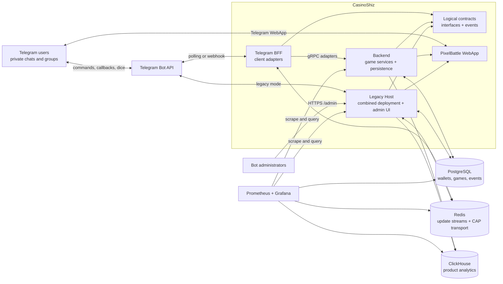

The repository supports two deployment shapes. `CasinoShiz.Host` is the compatible
modular-monolith composition. The split composition runs `CasinoShiz.Backend` and
`CasinoShiz.TelegramBff`; both depend on logical contracts while gRPC stays inside
transport projects. A bounded context can therefore remain in-process or cross the
process boundary without changing its application-facing interface.

## Runtime Containers

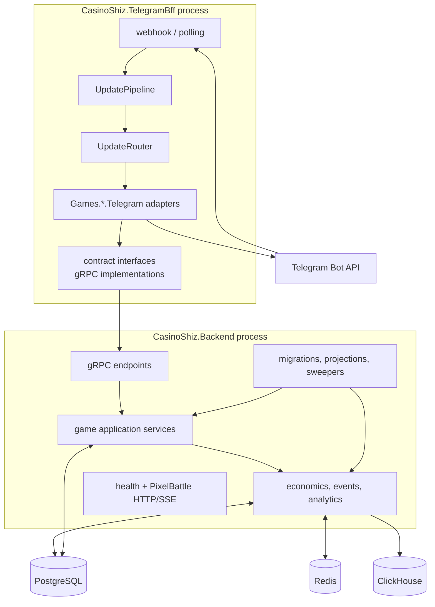

## Host Composition

Each composition root selects backend modules, Telegram adapter modules, or both.
Backend modules own persistence/migrations/jobs; adapter modules own handlers and
client presentation. Transport registration belongs only to Backend/BFF programs.

```mermaid
flowchart LR
    program["Program.cs"]
    builder["AddBotFramework()<br/>or AddBackendFramework()<br/>or AddTelegramBff()"]
    addmodule["AddModule&lt;T&gt;()"]

    subgraph framework["Framework registration"]
        telegram["Telegram runtime<br/>(adapter composition only)"]
        update["Update pipeline + router<br/>(adapter composition only)"]
        economics["Economics + daily limits"]
        tuning["Runtime tuning"]
        events["Event store + event bus"]
        analytics["Analytics"]
        admin["Admin auth + health"]
    end

    subgraph contribution["Module contribution"]
        handlers["IUpdateHandler<br/>(Telegram module)"]
        services["Module services"]
        commands["BotCommand"]
        locales["LocaleBundle"]
        migrations["IModuleMigrations<br/>(backend module)"]
        projections["Projections/subscribers"]
        modulejobs["Background jobs"]
    end

    loaded["LoadedModules aggregate"]
    app["WebApplication"]

    program --> builder
    program --> addmodule
    builder --> framework
    addmodule --> contribution
    contribution --> loaded
    framework --> app
    loaded --> app
```

Current module families:

- Telegram dice: slots, dice cube, darts, football, basketball, bowling;
- stateful games: blackjack, poker, Secret Hitler, horse racing;
- social and utility: challenges, pick/lotteries, transfer, redeem, PixelBattle;
- shared views: leaderboard, seasonal meta, admin and debug.

## Telegram Update Flow

Inside `BotFramework.Telegram`, polling and webhook delivery use the same processing
pipeline. This runs in `CasinoShiz.TelegramBff` or in the combined legacy Host.
Redis changes ingestion delivery, not the handler or logical client contracts.

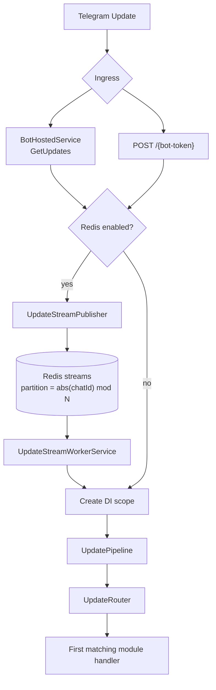

### Pipeline And Routing

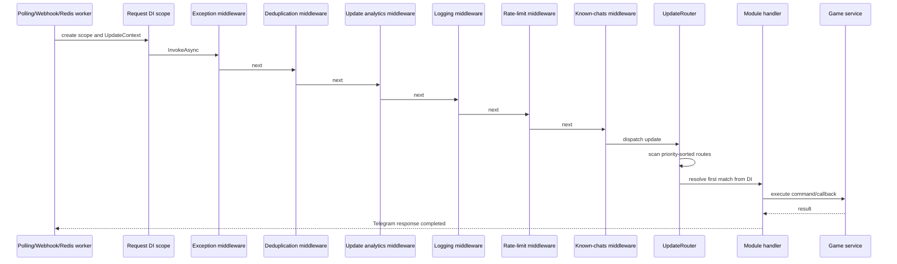

The effective middleware list is assembled by the framework registrations.
Routing attributes have descending priority:

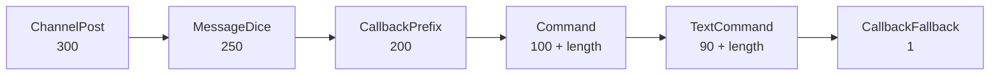

Only the first matching route is dispatched. Longer command names win ties, so
`/picklottery` takes precedence over `/pick`.

## Redis Update Delivery

Redis Streams preserve per-chat ordering by assigning the same chat to the same
partition. Different partitions can execute concurrently.

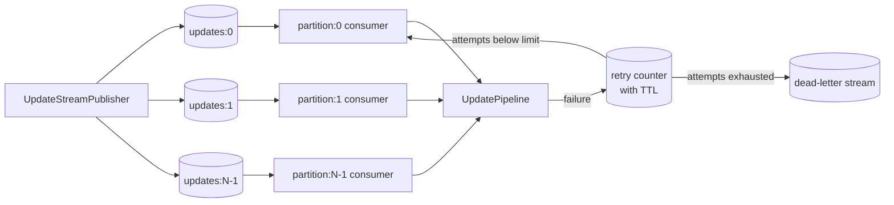

An entry is acknowledged only after successful pipeline processing. Failed entries
remain pending and are retried. After `MaxProcessingAttempts`, the payload and error
metadata are moved to the dead-letter stream and the original entry is acknowledged.

## Module Request Pattern

Most command paths follow the same dependency direction:

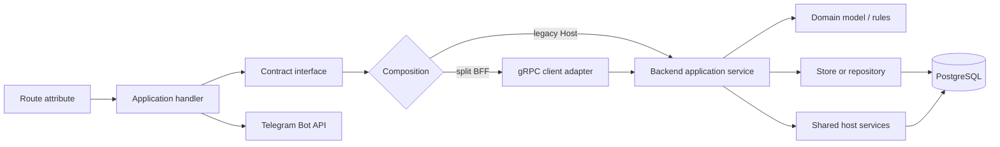

Handlers live in `Games.*.Telegram`, parse Telegram input, and render responses.
They know a logical interface, not whether it is local or remote. Backend services
own orchestration; domain objects own rules; stores own persistence. Protobuf,
generated clients, and channels remain in `Games.*.Transport.Grpc`. Cross-cutting
balance, analytics, tuning, locking, and event behavior belongs to framework services.

## Wallet And Ledger

The logical wallet/protection ports live in `BotFramework.Contracts`. Identity uses
the separate `IPlayerDirectory` port. Composition chooses their implementation:

- combined host/backend: local PostgreSQL services;
- split deployment: `CasinoShiz.IdentityService` and `CasinoShiz.WalletService`
  reached through adapters in `*.Transport.Grpc`;
- Telegram BFF: always consumes the logical ports and does not know whether their
  target is the main backend or a dedicated service.

Backend selection is configured with `Services:{Identity|Wallet}:Mode` (`Local` or
`Grpc`) and `Address`. The BFF accepts independent
`Services:{Identity|Wallet}:Address` values and falls back to
`Backend:GrpcAddress`. Transport choice therefore stays in composition roots.

Wallet account reads now cross `IWalletReadService`; ledger and operational
aggregates cross `IWalletAnalyticsService`. Game contexts no longer query the
compatibility `users` or `economics_ledger` tables. SQL for those tables is confined
to wallet-owned infrastructure. Legacy Razor admin pages are compiled into Backend
as a compatibility surface. In a split deployment the browser reaches them only
through Admin BFF, so the existing operator UI remains intact while pages migrate
to owning-context contracts incrementally.

## Admin BFF

`CasinoShiz.AdminBff` owns browser login/session state and registers no database
connection. After authentication it reverse-proxies `/admin/*` (except login and
logout) to Backend, adding the internal operations key and authenticated actor.
Backend validates those headers, creates the legacy server session, and executes
the original Razor pages and their antiforgery-protected actions.

The first migrated vertical slice contains wallet inspection, idempotent balance
adjustment and identity lookup. Each rendered adjustment carries a stable operation
ID, so repeating the same browser POST cannot apply the ledger mutation twice.
Service failures are reported per page rather than taking down unrelated sections.

The old `CasinoShiz.Host/Pages/Admin` remains the single compatibility UI source and
is linked into Backend at build time; it is not duplicated in AdminBff. A page can
later move behind an owning-context contract after its read/mutation contract and
server-side audit semantics exist.

Wallet identity is `(telegram_user_id, balance_scope_id)`. The balance scope is
normally the Telegram chat id, so one person has independent balances in different
groups and in private chat.

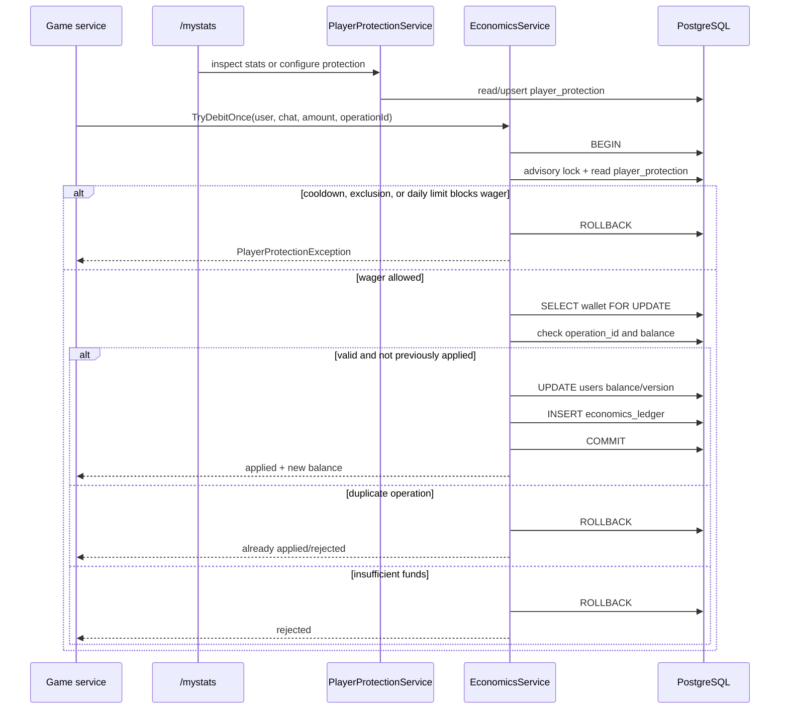

Important guarantees:

- `SELECT ... FOR UPDATE` serializes concurrent mutations to one wallet;
- wallet update and ledger append happen in one transaction;
- operation ids make critical debits, credits, transfers, refunds, and prizes idempotent;
- the ledger is append-only; admin recovery writes compensating rows.
- `PlayerProtectionService` reads player statistics and configures daily stake limits,
  cooldowns, and self-exclusion through `/mystats`;
- `EconomicsService` enforces those controls transactionally before protected wager
  mutations, while administrative, transfer, and rollback reasons are exempt.

## Event-Sourced Aggregate Flow

Event-sourced modules persist aggregate events first. Dispatch happens after append
commit, then updates read models, cross-module subscribers, and analytics.

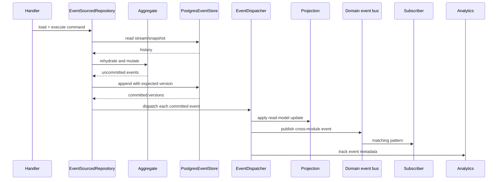

Dispatch is post-commit. A projection/subscriber failure does not roll back the event
append. Failures are persisted for retry, and event replay can rebuild projections.

## Domain Event Bus Modes

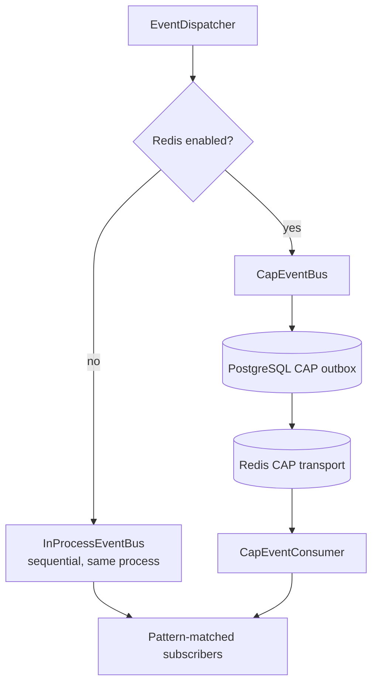

Subscriptions use event-name patterns such as `sh.game_ended`, `sh.*`,
`*.game_ended`, or `*`. Subscribers must be idempotent because distributed
delivery is at least once.

## Telegram Outbox

Critical Telegram messages emitted outside the live update response path are
persisted before sending. This covers event subscribers and background jobs where
`DB/event -> Telegram side effect` should survive process restarts and transient
Telegram failures.

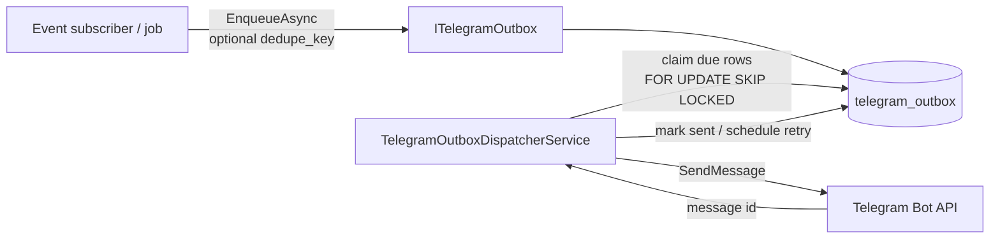

`dedupe_key` suppresses duplicate enqueues from repeated event handling. The
dispatcher records `telegram_message_id` on success and applies exponential retry
metadata on failure. Live handler replies, validation errors, menus, and other
immediate user interactions still use direct `ctx.Bot.SendMessage(...)` calls.

## Seasonal Meta Projections

Game modules publish `meta.game_completed`. The Meta module projects the event into
several independent features.

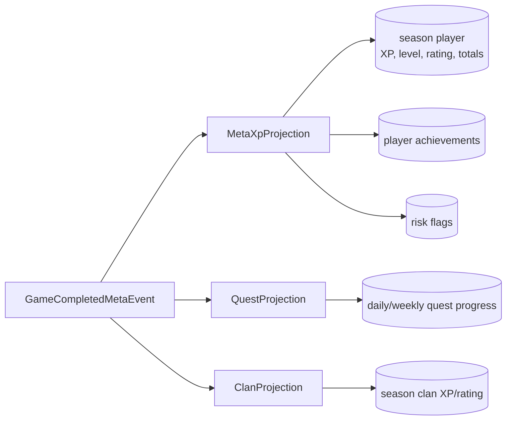

`/menu`, `/profile`, `/quests`, `/achievements`, `/clan`, and `/topseason`
read these projections. Tournament brackets are part of the same module but use
their own command-driven tables and idempotent economics operations.

## Runtime Tuning

Runtime settings are a database overlay on top of file and environment
configuration.

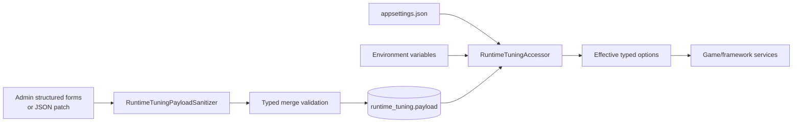

Precedence is:

1. `appsettings.json`;
2. environment variables;
3. whitelisted database patch.

Saving from `/admin/settings` sanitizes keys, validates typed sections, writes the
JSONB patch, reloads the accessor, and appends an admin audit record. Services that
read `IRuntimeTuningAccessor` receive changes without process restart.

## Admin And HTTP Surface

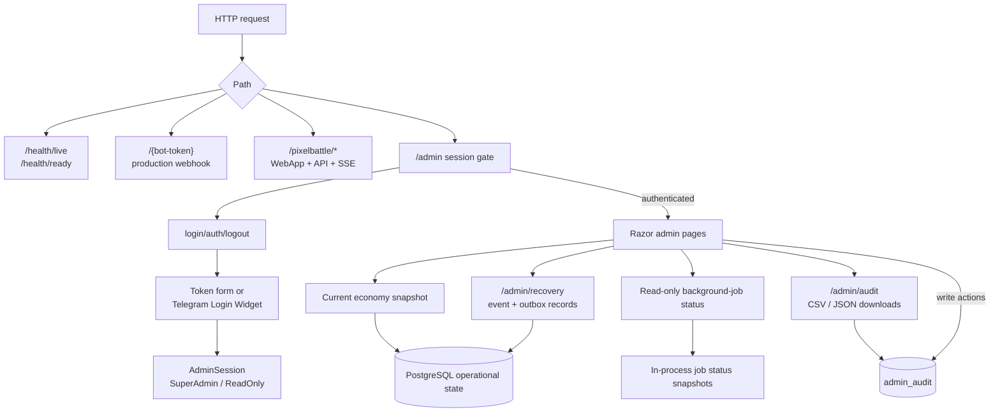

Read-only admins can inspect operational pages but mutation handlers return `403`.
SuperAdmin writes include balance changes, race actions, runtime tuning, and other
administrative operations. The dashboard economy snapshot and background-job table
are read-only operational views. `/admin/audit` returns browser downloads in CSV or
JSON while keeping the same role boundary as the on-screen audit view.

## Deployment Topology

### Docker Compose

The compose file exposes two explicit application profiles. `monolith` runs
`CasinoShiz.Host`; `microservices` runs Backend, Identity, Wallet, TelegramBff,
and AdminBff as separate containers. Both profiles reuse PostgreSQL and the
observability infrastructure. Internal calls use service DNS names and gRPC;
only composition/environment values differ between deployment modes.

```bash
docker compose --profile monolith up --build
docker compose --profile microservices up --build
```

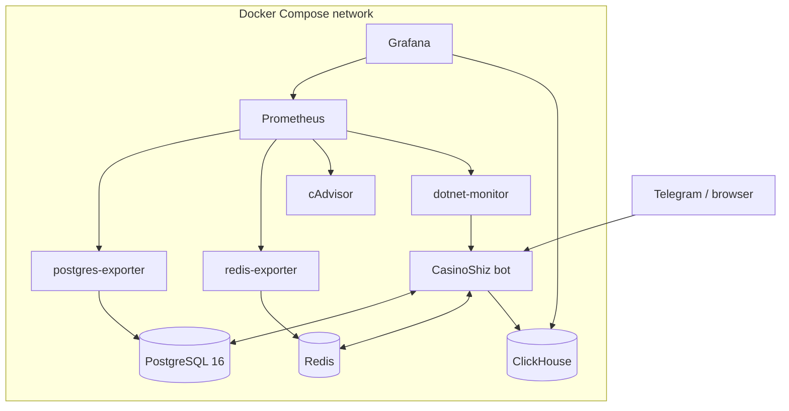

### Kubernetes / Helm

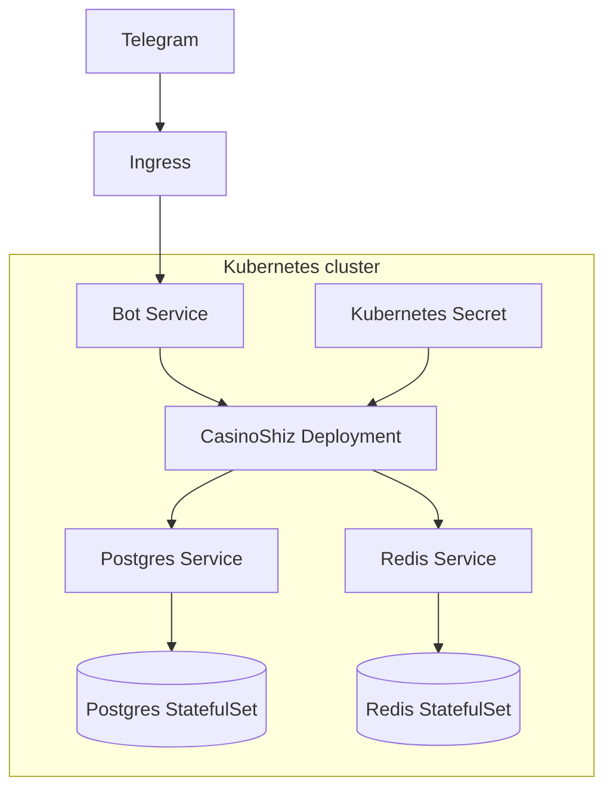

The shipped Helm chart includes the bot, PostgreSQL, and Redis. ClickHouse and the
monitoring stack are external or disabled by default in that topology.

## Failure And Recovery Boundaries

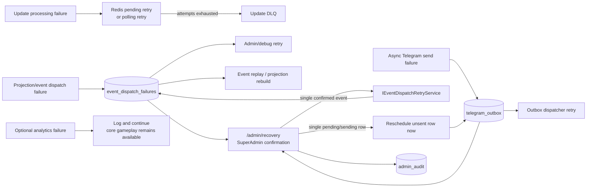

PostgreSQL is the primary consistency boundary. Redis improves coordination and
distributed delivery. ClickHouse and dashboards are operationally useful but do not
own game or wallet state. Recovery is deliberately record-by-record: authenticated
admins may inspect up to 100 current failures, but only SuperAdmin may confirm a
retry. Event retry redispatches the persisted event. Outbox recovery preserves the
payload, attempt count, deduplication key, and previous error while making an unsent
record immediately eligible; sent, missing, or concurrently changed records are not
mutated. Successful mutation attempts are appended to `admin_audit`.

The browser admin is a separate `CasinoShiz.AdminBff` process and never reads
PostgreSQL directly. It uses transport-neutral Identity, Wallet, and Operations
contracts; gRPC is an adapter selected only by composition. `Admin:ReadOnlyToken`
creates an inspection-only session and `Admin:SuperAdminToken` creates a session
allowed to submit antiforgery-protected mutations. The Admin BFF and Backend must
receive the same non-empty `Services:Operations:ApiKey` from deployment secrets;
the Backend rejects every Operations gRPC call when the key is absent or invalid.
Actor ID and name come from the authenticated server-side session, while the
Backend owns execution and audit recording. Wallet adjustments therefore remain
audited even when Wallet runs as a separate service.

## Dependency Rules

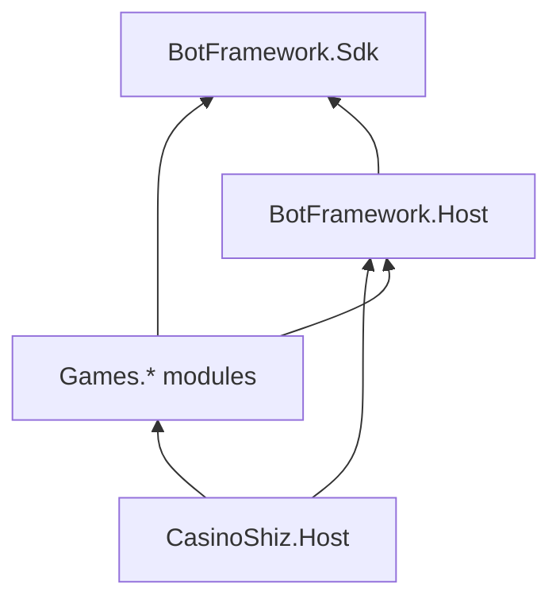

- `BotFramework.Sdk` contains contracts and shared event vocabulary.
- `BotFramework.Host` implements infrastructure and cross-cutting services.
- each `Games.*` project owns one bounded feature/module;
- `CasinoShiz.Host` selects modules and maps distribution-specific endpoints;
- modules should communicate through SDK contracts and domain events rather than
  importing another game's internals.
